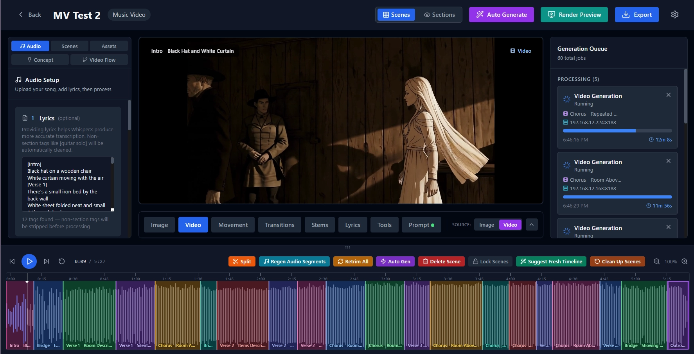

# Robomuffin Idea Factory

A local desktop application for creating AI-powered music videos and narration videos. Upload a song, analyze its structure, define your creative vision, and generate scene-by-scene AI images and videos — all synced to a visual timeline. Powered by ComfyUI remote servers for generation, with LLM-assisted prompt enhancement and creative direction.



## Sample Output

These videos were generated entirely by the app using ComfyUI + LTX 2.3 video generation:

<a href="https://www.youtube.com/watch?v=jg3y52mkEXI">
  
</a>

<a href="https://www.youtube.com/watch?v=NAf-MVPxjJI">
  
</a>

<a href="https://www.youtube.com/watch?v=ysumK--oPEI">
  
</a>

<a href="https://www.youtube.com/watch?v=hmp0o6oHwH8">
  
</a>

## Features

### Narration Chapters (long-form workflow)
- **Mini-projects inside a project** — Hour-long narrations break naturally into chapters of ~25 scenes. Click any chapter bar above the timeline (or any chapter name in the Chapters tab) to drill into a focused view with the Timeline, Scene Editor, Auto-Gen, and Export scoped to just that chapter's scenes.
- **Auto-chapter from script headers** — Drop `# Heading` / `## Heading` markers anywhere in the narration script and chapters appear automatically with names + colored timeline overlay. Without headers the project auto-splits by scene count (configurable threshold) at natural pause boundaries.
- **LLM chapter direction** — Each chapter has a `description`, `character_focus` list, and `style_notes`. The **✨ Generate ALL** button on the Chapters tab reads each chapter's narration text and asks the LLM for a 1-3 sentence concept + character cast + visual tone (one click for all 14 chapters). Per-card buttons regenerate individuals.
- **Per-chapter Story Flow** — **🎬 Generate Story Flow** on each chapter card runs per-scene flow generation scoped to that chapter, passing the chapter's description + characters + style as creative direction. Mini-project per chapter, mini-flow per scene inside it.
- **Chapter-scoped Auto-Gen and Export** — Run image/video auto-generation or render an MP4 for one chapter (or any multi-select of chapters). Export filename includes the chapter shortcode (e.g. `MyNarration - a3f9-ch-03.mp4`) so you can ship each chapter as a standalone YouTube short or episode.
- **Shortcodes for everything** — Stable `{project_prefix}-{type}-{seq}` IDs on every asset, scene, and chapter (e.g. `a3f9-img-0047`, `a3f9-ch-01`). Drop one in the URL as `/s/{code}` and you land on the right entity.

### Creative Pipeline
- **Audio Analysis** — Upload a song and automatically detect sections (intro, verse, chorus, bridge, outro), separate stems (vocals, drums, bass, other) via Demucs (auto-skipped in narration modes where source is already pure speech), and transcribe lyrics via Whisper (local WhisperX, remote Gradio, OpenAI-compatible, or ComfyUI workflow — server type auto-detected). Whisper timestamps are reconciled against the user's pasted source-of-truth text so burned-in subtitles match the script even when Whisper mis-hears. Long-narration Whisper timeouts scale with audio length (no more 1-hour cap on a 1-hour file)
- **Concept & Style** — Define your video's overall concept, visual style, and characters with reference images. "Base on Lyrics" lets an LLM generate your concept and style from the song's lyrics automatically
- **Video Flow** — LLM-generated per-scene storyboard ideas that describe camera movement, action, mood, and composition for each scene
- **Suggest Fresh Timeline** — LLM analyzes your lyrics, sections, and timing data to generate optimal scene boundaries with meaningful narrative breaks
- **Character Creator** — Built-in mini image generator for creating character reference images with version history, using the same reference image system as scene generation
- **LTXDirector Integration** — Full control over LTX Director video generation parameters: guide strength (keyframe conditioning), audio guidance (audio-to-video influence), stitch mode (smooth vs hard-cut prompt transitions), auto image description, and video negative prompt. All configurable in Settings
- **Scene Editor** — Tabbed editor with Image (First Frame / Last Frame sub-tabs), Video, Stems, Lyrics, Tools, Image Movement, and Prompt tabs per scene
- **Per-Scene Lyrics Override** — Manually edit auto-detected lyrics on any scene via the Lyrics tab Override button. Saves persist to scene parameters with a visual "Overridden" badge; Reset reverts to auto-detected lyrics
- **Reference Image System** — Select up to 2 characters and upload additional reference images per scene (up to 5 total for first frame, 4 for last frame). Workflow auto-selects based on reference count (0–5 images). Uses FLUX Klein "Image N" syntax for precise reference mapping
- **Two-Pass Image Generation** — Pass 1 generates the scene environment (no characters) using Z-Image Turbo regardless of your global single-image-generator setting; Pass 2 composites characters into the scene using the Pass 1 output as a reference. Prevents character IP-Adapter from making all scenes look identical. When two-pass is toggled on but no reference images are selected, the backend automatically downgrades to single-pass — no wasted Pass 1 followed by a silently-skipped Pass 2
- **Model indicator + per-pass preview** — every Image tab shows a live `Will render with:` badge predicting the exact model the backend will use (single chip for single-pass, two chips with a `→` for two-pass). Lightboxes label every preview with the actual model that produced it (read from `GenerationHistory.parameters.workflow_type` so it can't lie). "View Original" on a two-pass image opens the Pass 1 base in its own lightbox with its own model label so you can verify Pass 1 ran with Z-Image as expected
- **Split image / video resolution settings** — Concept tab exposes separate "Image Generation Size" and "Video Generation Size" fields under the unified Desired Resolution picker. Image jobs (Klein / Z-Image) and video jobs (LTX 2.3) can render at different sizes; leave either at 0 to fall through to the unified default. Rationale: Klein composites benefit from larger image dimensions for cleaner Pass 2 character compositing, while LTX video is usually rendered smaller and upscaled afterward
- **Import / Export Project Text Details** — a 3-dot menu item (all modes) that exports every editable text field of your project as JSON (concept, characters, chapters, scenes, prompts, story-flow ideas, transitions, per-scene resolution overrides) so you can hand it to an external AI agent to flesh out or rewrite, then re-import with "override all" or "fill missing only" semantics. Bundled with per-mode example JSONs and per-mode LLM instructions documents — linked directly from the dialog with one-click download. The agent sees the actual per-scene transcribed narration / lyrics text so prompts can be written ground-truth aware
- **Prompt Enhancement** — LLM-powered prompt enhancement with context awareness (model type, scene flow, camera action, character descriptions, reference images, lipsync state). Built-in system prompt registry with per-model overrides configurable in Settings. Video prompts are Director-aware with multi-segment support. Scene-to-scene continuity context tells the LLM whether it's extending a shot (FF/LF mode) or progressing the narrative (sequential mode), preventing wild visual shifts between consecutive scenes
- **Camera Action Presets** — 24 film-industry camera motions (pan, tilt, dolly, crane, orbit, steadicam, etc.) integrated into video prompt enhancement
- **Lipsync System** — Per-scene toggle that boosts audio_guidance to 0.7+ for better mouth-to-audio synchronization. Optional vocal stem isolation sends only the vocal track to the generator for cleaner sync signal. Default ON for new projects, configurable in Auto Gen modal and per-scene Video tab
- **Image Direction** — Control the overall visual style with presets (Photorealistic, Cinematic, Cartoon, Anime, Sketch, Watercolor, Oil Painting, 3D Render, Comic Book, Pixel Art, Abstract, Surreal) or custom free-text direction
- **Auto Generate** — Six intelligent modes: all images, all video (single frame), missing videos, all video (first/last frame chaining), all video (V2V extend for seamless transitions), and independent batch-parallel image generation
- **Image Movement (Ken Burns)** — Apply pan, zoom, and motion effects to still images during export
- **Export Transitions** — Automatic crossfade/dissolve transitions between clips with configurable duration and adjacent-clip color matching
- **Render Preview** — Quick 720p preview assembly before full export
- **Audio-Only Re-Mix** — After every successful export the silent concatenated video is cached. Re-exporting with the same scenes/dimensions but different audio mix settings (narration volume, backing track levels, fades, normalization) skips the multi-hour clip-render + chunk-merge work and only re-runs the audio mix + mux. Turns a "tweak the mixer and re-render" cycle from hours to seconds. Export modal also has a "Force full recreate" toggle for when you want a guaranteed fresh render
- **Export Audio Stems** — Checkbox on the export modal that also writes per-channel WAVs to `{output_dir}/stems/`: `narration.wav`, `backing_mix.wav`, and `backing_NN_<name>.wav` for each backing track. 48 kHz 16-bit PCM — drop straight into a DAW
- **Stems-Only Export** — Skip all video work entirely and just produce the audio stem WAVs. For when you already have the exported video and want to grab the stems later for outside-the-app mixing
- **Scene Locking** — Lock scene boundaries to prevent accidental changes. Persists across app restarts
- **Global Negative Prompt** — Set a negative prompt in Settings that applies to all image generation workflows. Per-scene negative prompts override the global when set. The effective negative prompt (global vs scene override) is displayed in each scene's Prompt tab after generation
- **Custom Workflow Management** — Upload your own ComfyUI workflow JSON files with auto-introspection and field mapping. Assign custom workflows per-server or globally, and select them from the Image/Video tab dropdowns
- **Asset Manager** — Browse and manage all project assets (characters, reference images, generated images/videos) with thumbnail grid view, lightbox preview, and direct-use-as-reference from the asset library
- **Live Batch Preview (PIP)** — Floating picture-in-picture overlay during batch processing shows the last generated image or video with scene name, elapsed time, prompt snippet, and IMAGE/VIDEO badge. Draggable (mouse + touch), resizable (small/medium/large), minimizable. Auto-positions to bottom-right corner
- **Mobile Responsive Layout** — Full mobile support lets you open the UI on your phone at `http://local-ip:8899` to monitor batch progress. Bottom navigation bar with panel/editor/queue tabs, collapsible sidebars, wrapping toolbars, and full-screen modals on small screens. Tablet breakpoint at 1024px
- **Batch Mode** — Queue multiple audio files with per-item configuration (render type, video mode incl. FF/LF chaining, image mode incl. previous-scene refs, two-pass, story flow, auto character generation, lipsync, override-full-set) and process them as a batch pipeline. Each item gets its own project with full concept/lyrics/character generation. Reliability hardening: per-step kickoff verification with `saw_running` idle-race guard, 2-hour per-step timeout, orphan-project cleanup on early failure, fresh-session lyrics retry, Whisper hard timeout, and surfaced auto-character warnings in the activity feed
- **Auto Gen Dashboard** — All Auto Gen runs are persisted and viewable on the `/batches` dashboard with status cards (running/completed/failed), progress bars, video/image thumbnails, and live-ticking elapsed timers. Click any card to see per-scene detail with live activity feed, step-by-step logs, worker IPs, asset previews, and error reports
- **Narration Images Mode** — Create narration-driven still image slideshows with Ken Burns effects. The entire pipeline (Auto-Gen modal, story-flow LLM call, prompt enhance, live preview, and final export) strictly enforces image-only output, so a project in this mode can never accidentally produce or play a video clip — even if older scenes have leftover `chosen_video_path` values from before the lock. Six layers of defense (server-side guards on `/auto`, `/auto-sequential`, `/enhance-prompt`, `_ensure_video_flow`, the export assembler, plus the frontend preview)
- **Narration Videos Mode** — Full video pipeline for speech narrations with storytelling-focused LLM prompts. Same powerful generation as Music Video mode, tuned for documentary and narration pacing
- **SRT Upload** — Import .srt subtitle files (e.g., from ElevenLabs cloud TTS) as an alternative to Whisper transcription, parsed into word-level timestamps
- **Subtitle Burn-In** — Configurable ASS subtitle overlay (font, size, color, position, outline) burned into final export via FFmpeg for narration modes
- **Subtitle Preview** — Live subtitle overlay synced to playback in the video preview panel
- **Backing Track Timeline** — Add background music tracks below the main scene timeline with per-track volume sliders, drag-drop upload, and delete controls
- **Audio Normalization** — Optional two-pass loudnorm normalization (target -14 LUFS, the streaming-platform standard used by Spotify/YouTube/Apple Music) during export for consistent audio levels across narration and backing tracks
- **FFmpeg Image Color Filter** — Concept tab dropdown ("Force Color Filter on Generated Images") applies B&W / Grayscale / Sepia via FFmpeg AFTER the model produces the image — deterministic pixel transform, independent of the LLM Color Override (which steers the prompt). Per-scene override on the Image tab can flip individual scenes back to Off or pick a different filter
- **Per-Worker Model Assignment** — Settings → ComfyUI Servers lets each worker be restricted to a specific subset of models (e.g. one machine runs Klein, another runs LTX). Multi-select chips under Image / Video checkboxes, with ALL as the default. Dispatcher routes each job to a worker that can run it
- **Generation Queue Model Badges** — Each in-flight job in the queue panel shows up to three chips: Pass 1/2 badge, model badge (Z-Image Turbo / Klein 9B · 3REF / LTX 2.3 · I2V etc.), and worker tag. So a long render queue tells you at a glance what's running where
- **Live Active Workers Panel (Batch Detail)** — Per-job progress bars on the BatchRun detail screen update live with the current ComfyUI node + percentage. 5-minute LTX renders no longer look "stuck" — you see the percentage climb in real time
- **Persistent Auto-Gen Status** — Reload the project page mid-run and the status pill + modal both repopulate from the BatchRun database row. No more losing visibility into a long auto-gen because of an accidental refresh
- **Auto-Gen Resilience** — A single scene failing (FF image timeout, worker offline, etc.) no longer kills the run. The failed scene is logged with `SKIPPING` and recorded in the batch error log; the remaining scenes still process. Heartbeat logs every 20-30s tell you exactly which job is being waited on so a slow worker can't masquerade as a hang
- **Truly Static Images** — When a scene's Image Movement is set to "none" / static, the export now renders the image with NO zoompan filter (just scale + pad held for the exact duration). Previously, "none" was silently coerced to `zoom_in_center` with `intensity=0` which still ran zoompan and produced subtle motion artifacts
- **Cache-key Completeness** — The export cache key now hashes per-scene color filter and per-scene image dimensions alongside the existing transitions / movement / dimensions. Changing any of these correctly invalidates the cache and forces a fresh render instead of silently reusing a stale concat.mp4
- **Stale Orphan Sweep at Startup** — Any job left `PENDING`/`RUNNING` for more than an hour by a previous backend session gets marked FAILED at boot with a clear error message. Prevents the auto-gen drain loop from waiting up to 30 minutes for ghost jobs whose ComfyUI workers are long gone. `recover_running_jobs()`'s fresh-restart reconnect path is preserved (only stale rows are touched)
- **Per-Run Drain Filter** — Auto-gen drain phase now filters by `Job.created_at >= run_started_at` so it only waits on follow-on jobs (two-pass composites, transition clips) created during THIS run. Pre-existing orphans for the same scene IDs are excluded automatically
- **Model-Generated Audio (LTX 2.3 AV-native)** — Concept tab **master toggle** ("Enable Model-Generated Audio") forces every I2V video in the project to use the AV-native LTX 2.3 workflow that drops the input-audio chain and lets the model produce speech / SFX / ambient in the same forward pass. When the master is on, the per-scene Video tab checkbox renders a `🔒 forced ON by project setting` badge. When the master is off, the per-scene checkbox acts as a one-scene opt-in. The generated audio is baked into the scene MP4 (visible immediately in per-scene preview) and extracted as a sidecar WAV so the project's "Model Audio" mixer slider can control its level independently of narration + backing tracks
- **Settings Import/Export** — Export all app settings to JSON and import on another machine for easy configuration sharing
- **Project Directory** — Configure where project data is stored via Settings, with the option to move existing data to a new location
- **Edit Project Name** — Rename projects via the toolbar menu (display name only — files and directories unchanged)

### Technical Highlights
- **Multi-server ComfyUI** — Concurrent dispatch across multiple remote ComfyUI instances with capability-based routing and worker reservation
- **LTXDirector Multi-Segment Prompts** — Video prompts can contain multiple segments separated by line breaks, each becoming a sequential temporal segment in the video. LLM prompt enhancer is Director-aware and generates single or multi-segment prompts based on scene content
- **V2V Extending** — Image-based conditioning from previous scene's last frame for seamless scene-to-scene transitions
- **AI Transition Clips** — LTX Transition LoRA generates short transition videos between scenes
- **Lipsync Audio Boost** — Per-scene lipsync toggle boosts Director audio_guidance from base level to 0.7+ for mouth-to-audio sync. Optional vocal stem isolation filters non-vocal audio before sending to generator
- **GPU Hardware Acceleration** — Auto-detects GPU encoders (NVIDIA NVENC, AMD AMF/VAAPI, Intel QSV) for FFmpeg and CUDA/ROCm for Demucs stem separation. Enable/disable toggle and re-detect button in Settings with live status cards. Note: Demucs GPU requires NVIDIA CUDA or AMD ROCm (Linux only) — AMD on Windows falls back to CPU
- **Color Correction** — Automatic per-channel RGB color matching with skip thresholds to avoid unnecessary re-encodes
- **RunPod Integration** — Optional serverless GPU pod management with auto-spindown
- **Real-time Progress** — SSE pub/sub broadcaster streams progress from ComfyUI to all connected frontends
- **Live Batch Preview** — Floating PIP overlay streams the latest generated asset during batch processing via SSE events, with scene info and elapsed time
- **Mobile Responsive** — CSS media queries at 768px/1024px breakpoints with mobile bottom nav bar, panel toggling, and toolbar wrapping for phone/tablet monitoring
- **Persistent Batch Runs** — Every Auto Gen run is tracked in the database with step-by-step activity logs, per-scene results, error history, and elapsed timing. Dashboard provides at-a-glance status across all batch runs with filtering by state
- **Desktop Native** — pywebview wraps the app in a native window (browser mode also available)

## ComfyUI Server Setup

Your remote ComfyUI server(s) need the following models and custom nodes installed. The app sends workflow API calls to these servers — it does not run ComfyUI locally.

### Required Models

Place these in the appropriate directories on your ComfyUI server(s):

#### Edit Model — Reference-Based Image Generation (FLUX.2 Klein 9B)

| File | Directory | Download |
|------|-----------|----------|
| `flux-2-klein-9b-Q8_0.gguf` | `models/unet/` | [Kijai/flux-2-klein-9b-gguf](https://huggingface.co/Kijai/flux-2-klein-9b-gguf) |
| `flux2-vae.safetensors` | `models/vae/` | [black-forest-labs/FLUX.1-dev](https://huggingface.co/black-forest-labs/FLUX.1-dev) |
| `qwen_3_8b_fp8mixed_abliterated.safetensors` | `models/clip/` | [Kijai/flux-2-klein-9b-gguf](https://huggingface.co/Kijai/flux-2-klein-9b-gguf) |

#### Single Image Generator — Text-to-Image (Z-Image Turbo)

Z-Image Turbo is a fast 6B-parameter text-to-image model using the S3-DiT architecture. It generates images in 8 sampling steps with no reference image support, making it ideal for two-pass base scene generation and character creation without references.

| File | Directory | Download |
|------|-----------|----------|
| `z_image_turbo_bf16.safetensors` | `models/diffusion_models/` | [Comfy-Org/z_image_turbo](https://huggingface.co/Comfy-Org/z_image_turbo/tree/main/split_files/diffusion_models) |
| `qwen_3_4b.safetensors` | `models/text_encoders/` | [Comfy-Org/z_image_turbo](https://huggingface.co/Comfy-Org/z_image_turbo/tree/main/split_files/text_encoders) |
| `ae.safetensors` | `models/vae/` | [Comfy-Org/z_image_turbo](https://huggingface.co/Comfy-Org/z_image_turbo/tree/main/split_files/vae) |

> **Tip:** Run `Download Models.bat` to download all Z-Image Turbo and Distilled LoRA models automatically.

#### Video Generation (LTX 2.3)

| File | Directory | Download |
|------|-----------|----------|
| `ltx-2.3-22b-dev-Q8_0.gguf` | `models/unet/` | [Kijai/ltx-video-gguf](https://huggingface.co/Kijai/ltx-video-gguf) (Q8_0 default; Q6_K and Q5_K_S also selectable in Settings) |
| `LTX23_video_vae_bf16.safetensors` | `models/vae/` | [Lightricks/LTX-Video](https://huggingface.co/Lightricks/LTX-Video) |
| `LTX23_audio_vae_bf16.safetensors` | `models/vae/` | [Lightricks/LTX-Video](https://huggingface.co/Lightricks/LTX-Video) |
| `ltx-2.3_text_projection_bf16.safetensors` | `models/clip/` | [Lightricks/LTX-Video](https://huggingface.co/Lightricks/LTX-Video) |
| `gemma_3_12B_it_fp4_mixed.safetensors` | `models/clip/` | [Kijai/gemma-3-12B-it_comfy](https://huggingface.co/Kijai/gemma-3-12B-it_comfy) |
| `ltx-2.3-spatial-upscaler-x2-1.0.safetensors` | `models/upscale_models/` | [Lightricks/LTX-Video](https://huggingface.co/Lightricks/LTX-Video) |

#### LoRAs — Image Generation (Flux Klein 9B)

| File | Directory | Download |
|------|-----------|----------|
| `lenovo_flux_klein9b.safetensors` | `models/loras/` | Required for T2I workflow |
| `nicegirls_flux_klein9b.safetensors` | `models/loras/` | Required for T2I workflow |
| `detail_slider_klein_9b_20260123_065513.safetensors` | `models/loras/` | Required for T2I workflow |
| `darkBeastFeb1826Latest_dbkBlitzV15.safetensors` | `models/loras/` | Required for T2I workflow |
| `anime2real-semi.safetensors` | `models/loras/` | Required for 1REF / 2REF / 3REF / 4REF / 5REF workflows |

#### LoRAs — Video Generation (LTX 2.3)

| File | Directory | Download |
|------|-----------|----------|
| `ltx-2.3-22b-distilled-lora-384-1.1.safetensors` | `models/loras/` | [Lightricks/LTX-2.3](https://huggingface.co/Lightricks/LTX-2.3) (v1.1 — **DEFAULT**, rank-384, ~7.6GB — improved aesthetics and audio, 8 steps instead of 20+) |
| `ltx-2.3-22b-distilled-lora-384.safetensors` | `models/loras/` | [Lightricks/LTX-2.3](https://huggingface.co/Lightricks/LTX-2.3) (v1.0 — optional alternate, same architecture as v1.1) |
| `ltx-2-19b-ic-lora-detailer.safetensors` | `models/loras/` | Required for FF/LF, I2V, and V2V workflows |
| `Ltx2.3-Licon-VBVR-I2V-96000-R32.safetensors` | `models/loras/` | Required for FF/LF, I2V, and V2V workflows |
| `ltx2.3-transition.safetensors` | `models/loras/` | [valiantcat/LTX-2.3-Transition-LORA](https://huggingface.co/valiantcat/LTX-2.3-Transition-LORA) (required for AI transition clips) |

### Required Custom Nodes

Install these via ComfyUI Manager or clone into `custom_nodes/`:

| Custom Node Pack | Purpose | Install |
|-----------------|---------|---------|
| **ComfyUI-LTXVideo** | All LTX 2.3 video nodes (sampling, VAE, latent guides, audio) | [github.com/Lightricks/ComfyUI-LTXVideo](https://github.com/Lightricks/ComfyUI-LTXVideo) |
| **ComfyUI-GGUF** | GGUF model loading for Klein + LTX quantized models | [github.com/city96/ComfyUI-GGUF](https://github.com/city96/ComfyUI-GGUF) |
| **ComfyUI-VideoHelperSuite** | Video output combining (VHS_VideoCombine) | [github.com/Kosinkadink/ComfyUI-VideoHelperSuite](https://github.com/Kosinkadink/ComfyUI-VideoHelperSuite) |
| **ComfyUI-KJNodes** | Image resize, VAE loading, math expressions | [github.com/kijai/ComfyUI-KJNodes](https://github.com/kijai/ComfyUI-KJNodes) |
| **WhatDreamsCost-ComfyUI** | LTXDirector + LTXDirectorGuide nodes for frame-controlled video generation (Sequencer workflows) | [github.com/WhatDreamsCost/WhatDreamsCost-ComfyUI](https://github.com/WhatDreamsCost/WhatDreamsCost-ComfyUI) |
| **ComfyUI-Easy-Use** | GPU memory cleanup between video passes (prevents OOM) | [github.com/yolain/ComfyUI-Easy-Use](https://github.com/yolain/ComfyUI-Easy-Use) |
| **rgthree-comfy** | Power LoRA loader, image comparison | [github.com/rgthree/rgthree-comfy](https://github.com/rgthree/rgthree-comfy) |
| **ComfyUI-Custom-Scripts** | Math expressions, switch nodes | [github.com/pythongosssss/ComfyUI-Custom-Scripts](https://github.com/pythongosssss/ComfyUI-Custom-Scripts) |
| **ComfyUI-Detail-Daemon** | DetailDaemonSamplerNode (Klein workflows) | [github.com/Jonseed/ComfyUI-Detail-Daemon](https://github.com/Jonseed/ComfyUI-Detail-Daemon) |
| **ComfyUI_essentials** | FastFilmGrain, FastLaplacianSharpen (Klein T2I) | [github.com/cubiq/ComfyUI_essentials](https://github.com/cubiq/ComfyUI_essentials) |
| **ComfyUI-TTPlanet** | LTXVFirstLastFrameControl_TTP (LTX FF/LF) | [github.com/TTPlanetPig/Comfyui_TTPlanet_Tile_Vae](https://github.com/TTPlanetPig/Comfyui_TTPlanet_Tile_Vae) |
| **ComfyUI-ResizeImagesByLongerEdge** | ResizeImagesByLongerEdge (LTX FF/LF) | search ComfyUI Manager |
| **ComfyUI-TrimAudioDuration** | TrimAudioDuration (LTX FF/LF) | search ComfyUI Manager |
| **ComfySwitchNode** | ComfySwitchNode (Klein workflows) | search ComfyUI Manager |

#### Optional Custom Nodes

| Custom Node Pack | Purpose | Install |
|-----------------|---------|---------|
| **ComfyUI-Whisper** | Whisper transcription via ComfyUI (alternative to local/Gradio) | [github.com/yuvraj108c/ComfyUI-Whisper](https://github.com/yuvraj108c/ComfyUI-Whisper) |

> **Note:** The app auto-detects missing custom nodes on each ComfyUI server before job submission. Non-essential missing nodes (like display/debug nodes) are automatically removed and bypassed. Essential missing nodes will produce a clear error message telling you which pack to install.

#### Whisper via ComfyUI Setup

If you already have a ComfyUI server running for image/video generation, you can use it for Whisper transcription too — no need to set up a separate Whisper server. This is especially useful on RunPod or remote GPU setups where installing WhisperX locally isn't practical.

1. **Install the custom node** on your ComfyUI server:
   ```
   cd ComfyUI/custom_nodes
   git clone https://github.com/yuvraj108c/ComfyUI-Whisper.git
   cd ComfyUI-Whisper
   pip install -r requirements.txt
   ```
   Or install via ComfyUI Manager by searching for "ComfyUI-Whisper".

2. **Restart ComfyUI** — the Whisper model (`openai/whisper-large-v3-turbo` by default) will download automatically on the first transcription run (~1.5 GB).

3. **Configure in the app** — Go to **Settings** and set the **Whisper ComfyUI URL** to your ComfyUI server address (e.g., `http://192.168.1.100:8188`). The app will auto-detect the server type when you process audio. You can also set `WHISPER_MODE=comfyui` in your `.env` file.

## Architecture

```
┌──────────────────────────────────────────────────────┐
│  pywebview (native desktop window)                   │
│  ┌────────────────────────────────────────────────┐  │
│  │  React 18 + TypeScript + Vite                  │  │
│  │  TailwindCSS, Zustand, wavesurfer.js           │  │
│  └──────────────────┬─────────────────────────────┘  │
│                     │ HTTP / SSE                      │
│  ┌──────────────────▼─────────────────────────────┐  │
│  │  FastAPI (Python 3.11.x recommended)            │  │
│  │  SQLite (WAL mode) via SQLModel + aiosqlite    │  │
│  │  Job Queue → ComfyUI Dispatcher                │  │
│  └───────┬──────────────────────┬─────────────────┘  │
└──────────┼──────────────────────┼────────────────────┘
           │ HTTP + WebSocket     │ Gradio / HTTP
┌──────────▼──────────────┐  ┌───▼───────────────────┐
│  ComfyUI Remote Servers │  │  Whisper Server        │
│  • FLUX.2 Klein 9B (img)│  │  (Gradio / ComfyUI /   │
│  • LTX 2.3 (video)      │  │   local WhisperX)      │
│  • Whisper (optional)    │  │                        │
└─────────────────────────┘  └────────────────────────┘
```

## Tech Stack

| Layer | Technology |
|-------|-----------|
| Desktop | pywebview 5.3+ |
| Frontend | React 18, TypeScript, Vite, TailwindCSS, Zustand, wavesurfer.js |
| Backend | FastAPI, SQLModel, aiosqlite, Pydantic v2 |
| AI Generation | ComfyUI (remote), FLUX.2 Klein 9B (images), LTX 2.3 (video) |
| Audio | Demucs (stems, GPU via PyTorch CUDA/ROCm), Whisper (3 backends), librosa (sections) |
| Video Assembly | FFmpeg (GPU-accelerated via NVENC/AMF/VAAPI/QSV) |
| LLM | OpenAI (GPT-4o through GPT-5.5), Anthropic Claude (3.5 Sonnet through Opus 4.7), Google Gemini, Ollama (local models with multi-server round-robin) |

## Prerequisites

- **Python 3.10–3.12** (3.11.x recommended) — Uses `StrEnum` and async features requiring 3.10+. Python 3.13+ is **not supported** due to PyTorch/WhisperX compatibility
- **Node.js 18+** and **npm** — For building the React frontend
- **FFmpeg** — On system PATH. Auto-detects GPU encoders (NVENC, AMF, QSV)
- **At least one remote ComfyUI server** — With the models and nodes listed above installed
- **At least one LLM provider** (recommended) — OpenAI, Anthropic, Gemini API key, or Ollama running locally/on LAN for prompt enhancement

## Installation

### 1. Clone and Set Up

```bash
git clone https://github.com/robomuffindev/RBMN-Storyboard_App.git
cd RBMN-Storyboard_App

# Python environment
python -m venv venv
source venv/bin/activate  # Linux/macOS
# venv\Scripts\activate   # Windows

# Optional: CUDA PyTorch for faster Demucs stem separation (NVIDIA GPUs)
pip install torch torchaudio --index-url https://download.pytorch.org/whl/cu121
# For AMD GPUs on Linux (ROCm):
# pip install torch torchaudio --index-url https://download.pytorch.org/whl/rocm6.0
# Note: AMD GPUs on Windows do not support PyTorch GPU — Demucs will use CPU

pip install -e ".[dev]"

# Frontend
cd frontend && npm install && npm run build && cd ..
```

### 2. Configure

```bash
cp .env.example .env   # Linux/macOS
# copy .env.example .env  # Windows
```

Edit `.env` with your ComfyUI server URL(s), Whisper settings, and LLM API keys.

### 3. Run

```bash
python run.py              # Desktop mode (pywebview)
python run.py --mode browser  # Browser mode
```

**Windows users** can also use the included batch scripts:
- `install.bat` — Full installation
- `run.bat` — Launch in desktop mode
- `Run_Browser_Mode.bat` — Launch in browser mode (opens `http://localhost:8899`)

### Fixing PyTorch CUDA (Existing Installs)

If you installed from an earlier version, your PyTorch may be CPU-only — local Whisper transcription and Demucs stem separation will run much slower (or fail silently). You can check by running:

```bash
python -c "import torch; print(torch.cuda.is_available())"
```

If it prints `False` and you have an NVIDIA GPU, run the included fix script:

```
fix-pytorch-cuda.bat
```

This auto-detects your GPU and CUDA version, uninstalls the CPU-only PyTorch, and reinstalls the correct CUDA build. New installs from `install.bat` will warn you if this is needed.

**AMD GPU users:** FFmpeg acceleration (AMF encoder/decoder) works on Windows and is auto-detected. However, PyTorch GPU (used by Demucs and local Whisper) requires ROCm which is Linux-only. On Windows with AMD, Demucs and local Whisper will run on CPU — this is fine since stem separation and transcription are one-time operations per project.

## Typical Workflow

1. **Create a project** — Choose Music Video, Narration (Moving Images), or Narration (Video) mode
2. **Upload audio** — Import your song or narration audio file
3. **Process audio** — Detect sections, separate stems, and transcribe lyrics
4. **Define concept** — Set song title, concept, style, characters, and image direction
5. **Suggest timeline** — Let the LLM create optimal scene boundaries from your lyrics
6. **Lock scenes** — Prevent accidental boundary changes
7. **Generate video flow** — LLM creates per-scene storyboard ideas
8. **Generate images** — Select character references, enhance prompts, generate first frames
9. **Generate videos** — Choose Single Image (I2V), First/Last Frame, or V2V Extend mode
10. **Preview and export** — Render preview, then export final video with transitions. Tweak mixer settings? Re-export with **Audio-only re-mix** to skip the multi-hour video work. Want stems? Check **Export audio stems** for per-channel WAVs, or **Stems only** to grab them later without any video rendering.

For batch jobs, use **Batch Mode** from the project list to queue multiple audio files with per-item config (render type, video mode incl. FF/LF chaining, image mode, lipsync, two-pass, story flow, auto-characters, override-full-set). Each item runs through the full pipeline above and you can monitor it from the persistent **Auto Gen Dashboard** at `/batches`.

## Development

```bash
# Backend (hot reload)
cd backend && uvicorn main:app --reload --port 8899

# Frontend (Vite HMR, separate terminal)
cd frontend && npm run dev

# TypeScript check
cd frontend && npx tsc --noEmit
```

### Debugging

When something goes wrong and you want to give an LLM (or yourself) a compact view of the running backend state — in-memory batch runs, auto-gen runs, ComfyUI worker stats, job queue depth, recent WARNING/ERROR log lines — run:

```bash
python tools/diag.py > diag.md
```

That hits `/api/debug/snapshot` and writes a small markdown summary you can paste straight into chat instead of multi-MB log dumps. Useful flags:

- `--logs 200` — include more recent log entries (default 40, max 500)
- `--grep batch` — only log 