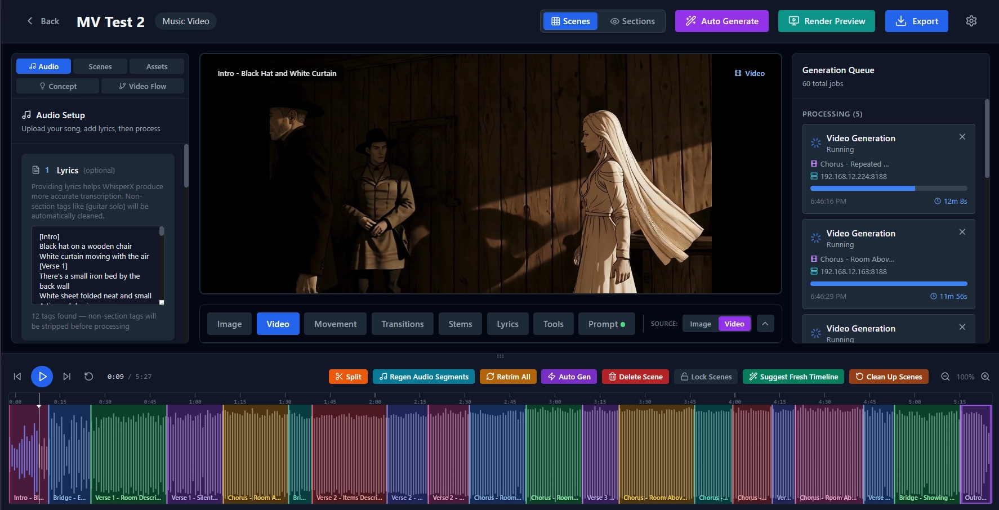

# Robomuffin Idea Factory

A local desktop application for creating AI-powered music videos and narration videos. Upload a song, analyze its structure, define your creative vision, and generate scene-by-scene AI images and videos — all synced to a visual timeline. Powered by ComfyUI remote servers for generation, with LLM-assisted prompt enhancement and creative direction.



## Status (v1.277.14, 2026-08-15)

**🎬 Projects now choose their VIDEO ENGINE** — **LTX 2.3** (the proven pipeline, still the
default), **MiniMax H3** (reference-driven consistency: character sheets, image & audio
references, native AV, per-project turbo/draft and audio modes), or **LTX 2.5** (models
staged on every worker; renders on 2.3 until its graphs go live). The 🌍 **Story/World
Builder** (`/worlds`) is where a world, its stories, a shared cast, texts and a visual
style are built — LLM-enhanced field by field or from one seed idea — then **bulk-submitted
to the character builder** and **linked to projects**, which can pull the concept, style,
cast (with generated images) and lyrics straight in. 🎯 **Klein Mode** is now fully
separated from VNCCS: Create is Klein 3.0, outfits live on the Clothes tab, poses on the
Pose Library tab; **VNCCS Native is retained untouched** as its own complete flow. Every
generated outfit auto-builds a **per-outfit character sheet** (the MiniMax identity
anchor); the 🎬 Video Lab is a home-screen destination with the v1.0 8-step turbo lora,
a 🏃 draft mode, per-render times, a 📚 character-image reference picker and a copyable
🤖 LLM prompting guide; the ⚡ Autogen queue can be **⏸ paused across a reboot**.

**🎧 The Audio Lab** (`/audio-lab`) generates BACKING TRACKS locally (ACE-Step 1.5 XL —
exact-length songs in seconds, paired to story arcs; MiniMax Music 3 slot auto-detects)
and NARRATIONS with **voice cloning** (F5-TTS: one clean 5-15s sample + its transcript,
paragraph-pause control) — the in-app ElevenLabs alternative; tracks import straight
into projects. Worlds also gained **📍 location sheets** (scouted by LLM, linked to
stories), a global **🧠 dedicated Prompt-LLM** setting, clean-base-look enforcement
(no more baked-in ink smudges), and **📦 download-once-LAN-copy** model distribution.

*Newest first: Audio Lab · location sheets · per-project video engines · Klein Mode split · Story/World Builder ·
per-outfit sheets · queue pause · [costume library](#-design-a-costume-before-anyone-wears-it).*

**⚡ An entire character — from a sentence to a trained LoRA — builds itself, unattended**
(v1.276.51: 7.12 h, all eight stages; training is 92% of it, so the chain without the LoRA
is ~32 minutes — and project auto character generation now runs through this builder too).

**MiniMax H3 runs locally on our own workers** — all five modes in-app (text→video,
image→video, first+last frame, last-frame, references→video with up to 9 image / 3 video /
3 audio references), 720p default, ⚡ turbo path, opt-in 🌀 SPECTRUM, prompts drafted by
Ollama from the canonical H3 spec. **First live render passed**: 5.17 s / 124 f / 1280×736
in 377 s including model load, with a real audio track. **⬆ LTX 2.3 enhancer upscale
passed** too: 1920×1088 in 494 s, re-detailing rather than re-imagining.

⚠ H3 and LTX disagree about legal frame counts (H3 wants `f%17==5`, LTX's VAE only carries
`f=8k+1`), so an upscale used to silently eat up to 7 frames off the tail. **`⬆ Upscale-safe
length` is now ON by default**: the render is one H3 step longer and the upscale is trimmed
back to the exact duration. Costs ~0.7 s of render; the frames it saves cannot be recovered
any other way. Running an upscale is still a deliberate button, not automatic.

**🎭 Every character, from every mode, in one place.** Characters lived in two disjoint
stores that were joined nowhere — a character made in Klein 3.0 was invisible on the
Character Studio page and in the clothing picker. `GET /api/characters` now merges both
behind polymorphic IDs, and the Character Studio front page is rebuilt in the Studio Hub's
language: one card per character showing its whole pipeline (front ref → views → dataset →
LoRA → sheet → lore) with real numbers, not progress bars.

**👗 Klein 3.0 outfit sets.** Name an outfit, fill as few or as many of **13 garment slots**
as you like (4 core: outerwear / top / bottom / shoes — 9 more for headwear, eyewear, base
layer, belt, legwear, gloves, jewellery, accessories, carried items), and it renders across
every view so a costume is consistent front, back and both sides. **Variants** capture one
look within an outfit ("jacket off") without a second wardrobe entry. Each view is a
standalone image, so any of them can be used as a reference elsewhere — and **a dataset can
now train from a chosen outfit** instead of only the character's default base. Outfits are
deletable per-variant or whole, and **↻ regenerate** re-renders one against your current
base images, replacing those views in place rather than stacking copies.

**⭐ The core set is its own thing.** A character's reference list now separates the images
that actually drive every render — front, back, left, right, face — from everything else,
with a placeholder tile marking any view you have not made yet. Outfit renders are not
repeated there; they live in the Outfits panel. And **any core reference can be
GAN-upscaled in place** to give every downstream render a sharper source.

**🖼 …and then we actually looked at it.** Three defects hid in a single upscaled reference.
The upscale workflow had **an anime model baked in** — beautiful on line art, ruinous on a
face, where it flattens skin into cells and draws black lines through hair; it now defaults
to a photoreal model (**pick your own**, and SeedVR2 if a worker has it), which took a face
crop's identity score from 0.84 to 0.98. Side views asked for "the same **outfit** as the
references", and the model does not read category words — so it invented its own trousers;
views now name every garment. And the face close-up could push the full-body reference out
of the list, so a side render had a face but nothing to dress; the body is pinned, and every
render reports which references it actually used.

**🧭 …and the base set now gets its own facing right.** ⭐ Asking for a right-side view produced
a left-facing pose about three times in four. The cause was a missing picture, not a missing
word: after an earlier fix removed the *wrong* side reference, a side view was being rendered
from two frontal images, so nothing in the job said which way to turn and the model's own
habit decided. The opposite profile is now **mirrored and passed back as a direction
reference**, cited by slot number — a mirrored left profile is a right-facing body. **Right
views went from roughly 1 in 4 to 5 of 5 on the first attempt**, confirmed on real
characters. Identity still comes from the face and front references, so nothing is flipped
that shouldn't be.

**✅ Every view is checked, free.** After each view renders, the app measures which way it is
actually facing — CPU only, no worker, no GPU — and re-renders it if it is wrong. A back view
is verified by the *absence* of a face. If every attempt fails, the view is left **missing**
rather than saved as the wrong thing: a gap is something an automated run can stop on, a
wrong image is something it would quietly build a dataset, a LoRA and a wardrobe on top of.
There is also a **🧭 Verify current views** button for sets you already have — the first time
it ran it found a bad view nobody had noticed. Regenerating a view now supersedes the old one
instead of stacking copies.

**👗 Outfits, rebuilt around how you actually use them.** Build one **from a photograph** —
the vision model names what it sees into the thirteen slots as editable text, and the photo
itself is passed to the render so the cut and hardware are copied rather than paraphrased
(tell it *"just the hat"* if that is all you want from the picture). The panel is a proper
editor: **＋ New outfit**, click any outfit to load it, **💾 Save** for text-only changes that
cost no renders, **＋ new variation** to spin off a look. Every view has its own tile whether
it exists or not — **↻** re-renders one, **🗑** deletes one, **＋ missing** fills only the
gaps. One bad render is two clicks to replace, and the views that came out well are never
touched.

**🙂 Every outfit gets a face close-up.** Earrings, a necklace, glasses and a collar are
decided at head height and are a handful of pixels in a full-body shot — the thing a wardrobe
most needs to show is the thing the body views cannot. So an outfit is five images now, and they
come in a deliberate order: the front view renders first, then the close-up is **cropped out
of that very render** — so it cannot disagree with the costume, because it *is* the costume —
and the remaining views use that close-up as their face reference. The front is upscaled
before the crop is taken, so the close-up starts from real detail rather than a hundred and
eighty pixels. The styling propagates instead of being re-invented, and the close-up costs no
extra render at all. "Regenerate all" now means the whole set, too — it used to
re-render only the views that already existed, so a gap could never close itself.

**👁 Outfits are checked against what you asked for.** A vision model looks at every finished
view and compares it to your garment list — what is missing, what came out the wrong colour,
and the one a prompt review can never catch: **something present that nobody asked for.** That
last case is what surfaced a real finding. A Supergirl costume kept adding glasses, and the
cause was not the reference list or the prompt builder — it was the *word*. **A character name
in a garment slot brings that character's accessories with it**: "a blue supergirl leotard"
produced glasses on five renders out of five, and no correction removed them, while the same
costume described literally at the same seed produced none on the first try. The app now warns
you as you type. And a reference photo that is too small to carry detail gets upscaled before
it is used, since every reference is resized to about a megapixel anyway.

### 👗 Design a costume before anyone wears it
 Describe an outfit in a sentence and the LLM
fills the thirteen garment slots for you. Then open the **Costume Studio**: render the costume
as an image — on a plain grey full-body mannequin standing on its own feet, so the reference carries the clothes and nothing else — not even a display stand
— with the model of your choice (Krea 2 by default) and a custom prompt if you want one. Pick
the render you like and it becomes that outfit's reference, with the slot text rescanned from
the image so the words and the picture agree. If you pick an edit-capable model (Klein or Qwen-Image-Edit) you can also **upload reference
photographs** — shoot a real garment and the design copies its cut, colour and fastenings
instead of guessing them from words; the uploader stays hidden for text-only models, where it
would do nothing. Every render lands in a **candidates** tray first — you approve the ones worth keeping, so the
library stays a wardrobe rather than a dumping ground. Costumes live in a shared library, so one
design can dress a whole cast, and you say up front whether it is cut for a woman, a man or
unisex — then filter by that, search across names, prompts and garments, rename anything, and
open an **ℹ info** panel on any costume to see exactly what made it: the model, the seed, the
garment list, the reference photos and the full prompt, ready to copy.

**🔍 One image viewer, everywhere.** Click any generated image for a full-screen lightbox
with cursor-anchored zoom, drag-pan, arrow-key stepping and download.

**⚙ Experimental Modes** (Settings, off by default) hides the parked development lanes —
🧪 Klein 1.0 and 🚀 Klein 2.0 — from the mode picker. Their code is intact and kept for
later use; they are simply not in the way.

**🆕 A brand-new character makes its whole base set in one press** (v1.276.39, verified end to
end): upload one photograph and the four views come back correct — the right-facing profile
waits for the left one, then copies its direction from a mirror of it.

**＋ New Character leads with 🎯 Klein 3.0** (v1.276.40) — the mode the app is built around is
the first, full-width option, and it takes the name inline so you land in the panel with the
character already made and selected. VNCCS Native sits underneath as its own independent
flow (the hybrid lane was retired in v1.277.13 — Klein Mode's create IS Klein 3.0).

**⚡⚡ Autogen — a character from nothing, as far as you want** (v1.276.42/.43). ＋ New Character
→ ⚡ Autogen: hand it reference photos *or just a description*, tick how far to go — base
character, the four views, clothing, character sheet, LoRA dataset, trained LoRA — and it runs
the chain and stops where you said. It shows the render cost before you commit, checks the base
set for free and stops rather than spending forty renders on a bad one, can be stopped mid-run,
and resumes where it left off after a restart. **Batch mode** queues many characters and runs
them one after another.

**🌍 Story / World Builder — the narrative layer** (v1.277.0). A home-page mode (`/worlds`)
where a WORLD holds the setting sheet, any number of STORIES, a shared CAST and your
lyrics/narrations. Every field is LLM-enhanceable (pick which configured brain per task), a
story's cast can be LLM-proposed under a cap you set, and ⚡ Big Bang turns one idea — a
sentence or three paragraphs — into a filled world, stories and a proposed cast without
overwriting anything you typed. Cast members are PAPER until you submit them: pick a depth
(details only → base → views → clothing → sheet → dataset → LoRA per item) and the whole
selection goes through the ⚡ Autogen serial queue in one batch, with the cost estimated
first. This is the bulk-submission mode that batch mode was parked for. Worlds link to
projects BOTH ways, and a linked project can ⬇ pull the concept, visual style, cast (with
generated character images imported) and lyrics/scripts straight in (v1.277.12).

**⚡ The whole fleet gets used** (v1.276.45). Independent renders fan across all three workers;
only a render that genuinely needs another render's output waits for it. Two lanes were quietly
using a single box — a Krea 2 batch and the Image Workshop — because asking the dispatcher for a
worker once per image returns the *same* box every time. Both now spread the work.

**🩺 The fleet looks after itself** (v1.276.48). Worker health is re-checked every 45 seconds:
a box that dies is dropped from the fan-out instead of silently failing every third image, and a
box that was asleep when the app started rejoins on its own rather than staying invisible until
the next restart.

**🔍 Verbose status and an ⏱ elapsed clock** (v1.276.46). The Autogen board has a persisted
verbose toggle and a per-job expander: the stage chain with a duration on every stage, the
base-set gate verdict, what it produced, and the full timestamped log. Timing comes from the
server, so it survives a page reload or a backend restart — which is exactly when an hours-long
run needs it.

**🚦 Preflight and ◎ likeness at a glance** (v1.276.50/.52). `scripts/preflight_autogen.py`
checks every dependency of a long run in seconds and answers GO / NO-GO, and the Autogen board
shows each run's likeness score — warning you when the epoch installed was not the best-scoring
one.

Next, in order (the same list as `docs/OPERATIONS.md` §10 and `HANDOVER_PROMPT.md` — they are
kept identical): (1) model re-staging in flight — the 2026-08-16 restart truncated in-flight
downloads and helper ≤v1.220 promoted partials as "done"; `audit_model_integrity.py` is the
byte-size instrument (`--fix` repairs); fresh pulls run on ZOAI1, the trainer's E: models
drive is FULL (known-garbage list in the v1.277.15 CHANGELOG), helper v1.221 needs redeploy;
(2) LTX 2.5 — IN PLACE, NOT A FOCUS (his call): graphs wired + validated, HIDDEN from the
frontend pickers (grep `ltx_2.5 hidden` to restore); don't chase staging/integration;
(3) MiniMax Music 3 — graph wired + spec-verified, first render pending its text encoder;
he wants MM3 tested on EVERY box before restarting the app (`mm3_first_render.py`)
(ACE-Step 1.5 is DONE, verified 3/3 live); (4) MiniMax H3 project lane —
first LIVE end-to-end scene render pending (smoke + review verified); and tools.py's sample
generator still carries the broken raw-workflow krea2 path (use z_image/anima/klein there);
(5) the adopt-k3 cast watcher doesn't survive a restart — re-adopt by hand after a reboot
mid-cast; (6) F5-TTS first voice clone needs Lorenzo's 5-15s sample + transcript;
(7) the base-outfit picker in the LoRA panel (route built + tested, no UI); (8) H3's
Video-Lab modes beyond t2v/i2v (first+last, last-frame, references→video); (9) whether 🙂
`face_first` earns its keep at all; (10) `LoraPanel`'s `nOutfit` has no setter wired to any
control, so a new dataset's "outfit" field always submits `''`. Recently closed: Story/World
follow-through (pull-from-story is BUILT; the LLM lanes and a real 7-character batch ran
live) and publishing (normal cadence since v1.277.3). See
**`docs/OPERATIONS.md`** (the runbook), `docs/KLEIN3.md` (the character/outfit/costume lane),
`CHANGELOG.md` (the decision log — it records retractions, so read a claim's newest mention)
and `HANDOVER_PROMPT.md`.

### Previous status (v1.271.2, 2026-08-08)

**The character pipeline is complete and measured, end to end.** Three new modes landed on
2026-08-07/08: **🧬 Text 2 Image** (the master character entry point — name-first resumable
characters, multi-engine T2I, Klein edit-iterate loop, master gallery, promote-to-front-ref,
📖 Profile & Lore for the future Story Builder), **🪪 Character Sheet** (one downloadable
reference image per character for sheet-as-reference models like MiniMax H3 — pure
compositing, no GPU), and the LoRA training loop run four times end-to-end. The **controlled
experiment** (same character, same pipeline, dataset upgraded balanced-20 -> face_heavy-39)
proved likeness tracks dataset quality proportionally: dorian 0.81 (ds 0.69) / redv1-v1 0.57
(ds 0.534) / redv1-v2 0.61 (ds 0.568). **Standing dataset recipe:** face_heavy 40, universal
face ref, dressed base, one targeted re-render round, likeness floor 0.25 at export. Rules for
LoRA consumers: always name the outfit in the prompt; unload the LoRA for shots the character
isn't in; strength 1.0; fp8 on 40xx boxes. **v1.271: the whole loop is in-app — 🚀 Train on
any dataset and ⚡ Autogen (one button from a front reference to an installed LoRA, with
signature-outfit vs wardrobe-variations modes), plus a Training Worker settings card showing
the box's own ComfyUI/Fizgig install paths with detect-and-switch.** See
**`docs/OPERATIONS.md` (the runbook)**, `docs/LORA_DATASET.md`, and `HANDOVER_PROMPT.md`.

## Previous status (v1.267.0, 2026-08-07)

**Character LoRA lane VALIDATED end-to-end.** Klein 3.0 character -> planned/QC'd dataset ->
Fizgig Krea 2 training on a remote worker -> ArcFace checkpoint pick -> one-call install into
ComfyUI -> measured TURBO exam: likeness 0.81 vs a 0.12 no-LoRA control, wardrobe fully
promptable. Two rules for consumers: **always name the outfit in the prompt** (captioned
clothing = promptable clothing; an unclothed prompt renders skin) and **unload the LoRA for
shots the character isn't in**. See `docs/LORA_DATASET.md` (training loop at the end) and
`HANDOVER_PROMPT.md`. Character two (redv1) is the in-flight generality proof.

## Pose system status (v1.199.146, 2026-08-01 — parked lane)

**The welded-arm ceiling is gone.** The mesh-ready base set is T-posed per view by a pure Klein
image edit (no mannequin in the path), the mesh carries the character's build at 1.02x, and it
deforms cleanly when posed. Recipe for posing: **Use 3D body ON + Pose input = Normal + structure
lock OFF**. Poses are driven by the app-side default set in `workflows/vnccs/RBMN_POSES.json`
(pre-selected in the Poses tab with rendered silhouettes; `?source=vnccs` restores the old twelve).

Still open: the ankle rests ~15 deg off the frame poses are authored in, shoulders were just
corrected (v146, unverified), hands are Klein's weak spot, and crouch/seated poses need pelvis
translation the pose format does not have.

**Start any new work by reading `HANDOVER_PROMPT.md`** (state, open items in priority order, the
method, the iron rules) and project memory. `gap_test.bat` is RETRACTED as an invalid instrument --
do not use it. Useful tools: `body_match.bat`, `tpose_retry.bat`, `worker_run.bat`,
`prototypes/pose_lab/`.

## Sample Output

These videos were generated entirely by the app using ComfyUI + LTX 2.3 video generation:

<a href="https://www.youtube.com/watch?v=jg3y52mkEXI">
  
</a>

<a href="https://www.youtube.com/watch?v=NAf-MVPxjJI">
  
</a>

<a href="https://www.youtube.com/watch?v=ysumK--oPEI">
  
</a>

<a href="https://www.youtube.com/watch?v=hmp0o6oHwH8">
  
</a>

## Features

### Character Studio
- **🎭 Character Studio front page (`/studio`)** — every character from every mode in one
  grid, whichever mode created it. One card per character shows its whole pipeline as a
  checklist with real numbers ("views 3/4 (missing left, back)", "dataset 47/120 · ⚠3"),
  a source badge, live status, name search and per-source filtering. Buttons are
  capability-aware: a Klein 3.0 character offers views / outfits / dataset / sheet, a
  VNCCS one offers clothes / emotions / details.
- **👗 Outfit sets (Klein 3.0)** — name an outfit and fill as few or as many of **13
  garment slots** as you want: 4 core (outerwear, top, bottom, shoes) and 9 more
  (headwear, eyewear, base layer, belt, legwear, gloves, jewellery, accessories, carried).
  It renders across every view, so a costume is consistent front, back and both sides.
  **Variants** capture one look within an outfit ("jacket off") without needing a second
  wardrobe entry. Every view is a standalone image usable as a reference anywhere, and a
  LoRA dataset can be pointed at an outfit instead of the character's default base.
- **🔍 Image lightbox everywhere** — click any generated image for full-screen review with
  cursor-anchored zoom, drag-pan, ←/→ through the gallery, and download.
- **⭐ Core reference set** — front / back / left / right / face shown apart from extras,
  with a placeholder for any view not yet made, and **⬆ GAN upscale on any single
  reference** so the images every render reads from can be sharpened.
- **🗑 Delete characters** from the Studio grid. The confirmation names what actually goes:
  Klein 3.0 removes the character folder but its LoRA datasets and character sheets live
  elsewhere and survive, and VNCCS characters ask separately about worker-side sprites.
- **⚙ Experimental Modes** (Settings, off by default) — reveals the parked development
  lanes (🧪 Klein 1.0, 🚀 Klein 2.0). Their code is intact and kept for later use such as
  game-asset export; this only controls whether they appear in the mode picker.
- **🏠 Studio Hub** — the landing tab: every character's whole pipeline at a glance
  (front ref → views → dataset → LoRA → sheet → lore, live train/autogen stages) with
  one-click jumps into any tab, character preselected.
- **🧬 Text 2 Image** — master character creation: name-first resumable characters,
  engines Klein (0–5 refs) / Krea 2 Turbo (the LoRA-testing engine — picker with trigger
  display + add-to-prompt), pose scaffolds, batch 1–8, Klein edit-iterate loop with
  version chains, master gallery, 🏁 promote-to-front-reference, and 📖 Profile & Lore
  per character (physical fields + backstory — the future Story Builder substrate,
  ✨ LLM-fillable).
- **🪪 Character Sheet** — downloadable reference sheets per character: the classic
  turnaround + face row from identity-scored dataset renders, AND (v1.277.2) **per-OUTFIT
  sheets** — five cells composed only from that outfit's own rendered views, the format
  reference-driven video models actually want; every generated outfit auto-builds its own
  2048px sheet (v1.277.12). The panel keeps a labelled, downloadable sheet library.
  No GPU, no LoRA needed.
- **🎬 Video Lab (MiniMax H3, local — a HOME-SCREEN destination since v1.277.7, `/video-lab`)**
  — five modes: text→video, image→video, first+last frame, last-frame, references→video
  (up to 9 reference images, 3 reference videos each with an optional use-its-soundtrack
  toggle, 3 standalone audios, match/max identity fidelity). 720p default, the **Lightx2v
  v1.0 8-step turbo lora** (distilled at 8 NFE, v1.277.8) with a **🏃 4-step draft mode**
  for testing, per-render times live and final, a **📚 character-image reference picker**
  (sheets/views/dataset with preview), 🧠 LLM prompt drafting, a copyable **🤖 Prompt for
  LLMs** guide, and **⬆ LTX 2.3 enhancer upscale** on any finished render. Jobs persist
  across restarts. Method: docs/MINIMAX_H3_PROMPTING.md.
- **🎓 LoRA Dataset Gen + Training** — plan, render, caption, QC (framing/angle/identity/
  artifacts/**wardrobe** — all measured instruments), repair and export a training-ready
  character LoRA dataset from a Klein 3.0 character; then train it on a remote Fizgig worker,
  score checkpoints by ArcFace (never loss), install into ComfyUI and validate on Krea 2
  TURBO — the whole loop headless via the Worker Helper + agent (docs/LORA_DATASET.md).
- **🛠 Worker Helpers (fleet management)** — every render box runs `rbmn_helper.py`
  (:8765, per-box auto-generated tokens): dataset/training lifecycle on the trainer, plus
  fleet-wide `/inventory` (nodes, models, env), node/pip installs, background model
  downloads, LoRA sync between boxes, and the full SageAttention install+verify recipe
  (real-kernel proof, measured 37% speedup). Managed from Settings → Worker Helpers
  (multi-worker registry: per-row host/token/paths, 🔍 Detect, ⭐ trainer). All boxes are
  DHCP — edit the row when an IP moves. Full reference: docs/WORKER_HELPER.md.

### Narration Chapters (long-form workflow)
- **Mini-projects inside a project** — Hour-long narrations break naturally into chapters of ~25 scenes. Click any chapter bar above the timeline (or any chapter name in the Chapters tab) to drill into a focused view with the Timeline, Scene Editor, Auto-Gen, and Export scoped to just that chapter's scenes.
- **Auto-chapter from script headers** — Drop `# Heading` / `## Heading` markers anywhere in the narration script and chapters appear automatically with names + colored timeline overlay. Without headers the project auto-splits by scene count (configurable threshold) at natural pause boundaries.
- **LLM chapter direction** — Each chapter has a `description`, `character_focus` list, and `style_notes`. The **✨ Generate ALL** button on the Chapters tab reads each chapter's narration text and asks the LLM for a 1-3 sentence concept + character cast + visual tone (one click for all 14 chapters). Per-card buttons regenerate individuals.
- **Per-chapter Story Flow** — **🎬 Generate Story Flow** on each chapter card runs per-scene flow generation scoped to that chapter, passing the chapter's description + characters + style as creative direction. Mini-project per chapter, mini-flow per scene inside it.
- **Chapter-scoped Auto-Gen and Export** — Run image/video auto-generation or render an MP4 for one chapter (or any multi-select of chapters). Export filename includes the chapter shortcode (e.g. `MyNarration - a3f9-ch-03.mp4`) so you can ship each chapter as a standalone YouTube short or episode.
- **Shortcodes for everything** — Stable `{project_prefix}-{type}-{seq}` IDs on every asset, scene, and chapter (e.g. `a3f9-img-0047`, `a3f9-ch-01`). Drop one in the URL as `/s/{code}` and you land on the right entity.

### Creative Pipeline
- **Audio Analysis** — Upload a song and automatically detect sections (intro, verse, chorus, bridge, outro), separate stems (vocals, drums, bass, other) via Demucs (auto-skipped in narration modes where source is already pure speech), and transcribe lyrics via Whisper (local WhisperX, remote Gradio, OpenAI-compatible, or ComfyUI workflow — server type auto-detected). Whisper timestamps are reconciled against the user's pasted source-of-truth text so burned-in subtitles match the script even when Whisper mis-hears. Long-narration Whisper timeouts scale with audio length (no more 1-hour cap on a 1-hour file)
- **Concept & Style** — Define your video's overall concept, visual style, and characters with reference images. "Base on Lyrics" lets an LLM generate your concept and style from the song's lyrics automatically
- **Video Flow** — LLM-generated per-scene storyboard ideas that describe camera movement, action, mood, and composition for each scene
- **Suggest Fresh Timeline** — LLM analyzes your lyrics, sections, and timing data to generate optimal scene boundaries with meaningful narrative breaks
- **Character Creator** — Built-in mini image generator for creating character reference images with version history, using the same reference image system as scene generation
- **🎯 Klein 3.0 (pure reference mode)** — The active character-posing lane (docs/KLEIN3.md): tagged 2D references + a stripped/upscaled base + a shared Pose Library (named SETS, tag filters, JSON/CSV + openpose/depth pack imports, LLM-generatable sets) → 2-ref Klein generation of single poses, whole sets, or tag selections, threaded across all workers with live per-job worker status
- **🚀 Klein 2.0 (3D statue mode, pinned)** — TRELLIS.2-textured rotatable statue → exact-angle snapshot as identity ref (docs/KLEIN2.md, postmortem in docs/KLEIN2_3D_POSTMORTEM.md; pinned on 16GB-VRAM likeness ceiling, kept for future use)
- **LTXDirector Integration** — Full control over LTX Director video generation parameters: guide strength (keyframe conditioning), audio guidance (audio-to-video influence), stitch mode (smooth vs hard-cut prompt transitions), auto image description, and video negative prompt. All configurable in Settings
- **Scene Editor** — Tabbed editor with Image (First Frame / Last Frame sub-tabs), Video, Stems, Lyrics, Tools, Image Movement, and Prompt tabs per scene
- **Per-Scene Lyrics Override** — Manually edit auto-detected lyrics on any scene via the Lyrics tab Override button. Saves persist to scene parameters with a visual "Overridden" badge; Reset reverts to auto-detected lyrics
- **Reference Image System** — Select up to 3 characters and upload additional reference images per scene (up to 5 total references, auto-balanced across characters and their extra identity-lock angles). Workflow auto-selects based on reference count (0–5 images). Uses FLUX Klein "Image N" syntax for precise reference mapping
- **Two-Pass Image Generation** — Pass 1 generates the scene environment (no characters) using Z-Image Turbo regardless of your global single-image-generator setting; Pass 2 composites characters into the scene using the Pass 1 output as a reference. Prevents character IP-Adapter from making all scenes look identical. When two-pass is toggled on but no reference images are selected, the backend automatically downgrades to single-pass — no wasted Pass 1 followed by a silently-skipped Pass 2
- **Model indicator + per-pass preview** — every Image tab shows a live `Will render with:` badge predicting the exact model the backend will use (single chip for single-pass, two chips with a `→` for two-pass). Lightboxes label every preview with the actual model that produced it (read from `GenerationHistory.parameters.workflow_type` so it can't lie). "View Original" on a two-pass image opens the Pass 1 base in its own lightbox with its own model label so you can verify Pass 1 ran with Z-Image as expected
- **Split image / video resolution settings** — Concept tab exposes separate "Image Generation Size" and "Video Generation Size" fields under the unified Desired Resolution picker. Image jobs (Klein / Z-Image) and video jobs (LTX 2.3) can render at different sizes; leave either at 0 to fall through to the unified default. Rationale: Klein composites benefit from larger image dimensions for cleaner Pass 2 character compositing, while LTX video is usually rendered smaller and upscaled afterward
- **Import / Export Project Text Details** — a 3-dot menu item (all modes) that exports every editable text field of your project as JSON (concept, characters, chapters, scenes, prompts, story-flow ideas, transitions, per-scene resolution overrides) so you can hand it to an external AI agent to flesh out or rewrite, then re-import with "override all" or "fill missing only" semantics. Bundled with per-mode example JSONs and per-mode LLM instructions documents — linked directly from the dialog with one-click download. The agent sees the actual per-scene transcribed narration / lyrics text so prompts can be written ground-truth aware
- **Prompt Enhancement** — LLM-powered prompt enhancement with context awareness (model type, scene flow, camera action, character descriptions, reference images, lipsync state). Built-in system prompt registry with per-model overrides configurable in Settings. Video prompts are Director-aware with multi-segment support. Scene-to-scene continuity context tells the LLM whether it's extending a shot (FF/LF mode) or progressing the narrative (sequential mode), preventing wild visual shifts between consecutive scenes
- **Camera Action Presets** — 24 film-industry camera motions (pan, tilt, dolly, crane, orbit, steadicam, etc.) integrated into video prompt enhancement
- **Lipsync System** — Per-scene toggle that boosts audio_guidance to 0.7+ for better mouth-to-audio synchronization. Optional vocal stem isolation sends only the vocal track to the generator for cleaner sync signal. Default ON for new projects, configurable in Auto Gen modal and per-scene Video tab
- **Image Direction** — Control the overall visual style with presets (Photorealistic, Cinematic, Cartoon, Anime, Sketch, Watercolor, Oil Painting, 3D Render, Comic Book, Pixel Art, Abstract, Surreal) or custom free-text direction
- **Auto Generate** — Six intelligent modes: all images, all video (single frame), missing videos, all video (first/last frame chaining), all video (V2V extend for seamless transitions), and independent batch-parallel image generation
- **Image Movement (Ken Burns)** — Apply pan, zoom, and motion effects to still images during export
- **Export Transitions** — Automatic crossfade/dissolve transitions between clips with configurable duration and adjacent-clip color matching
- **Render Preview** — Quick 720p preview assembly before full export
- **Audio-Only Re-Mix** — After every successful export the silent concatenated video is cached. Re-exporting with the same scenes/dimensions but different audio mix settings (narration volume, backing track levels, fades, normalization) skips the multi-hour clip-render + chunk-merge work and only re-runs the audio mix + mux. Turns a "tweak the mixer and re-render" cycle from hours to seconds. Export modal also has a "Force full recreate" toggle for when you want a guaranteed fresh render
- **Export Audio Stems** — Checkbox on the export modal that also writes per-channel WAVs to `{output_dir}/stems/`: `narration.wav`, `backing_mix.wav`, and `backing_NN_<name>.wav` for each backing track. 48 kHz 16-bit PCM — drop straight into a DAW
- **Stems-Only Export** — Skip all video work entirely and just produce the audio stem WAVs. For when you already have the exported video and want to grab the stems later for outside-the-app mixing
- **Scene Locking** — Lock scene boundaries to prevent accidental changes. Persists across app restarts
- **Global Negative Prompt** — Set a negative prompt in Settings that applies to all image generation workflows. Per-scene negative prompts override the global when set. The effective negative prompt (global vs scene override) is displayed in each scene's Prompt tab after generation
- **Custom Workflow Management** — Upload your own ComfyUI workflow JSON files with auto-introspection and field mapping. Assign custom workflows per-server or globally, and select them from the Image/Video tab dropdowns
- **Asset Manager** — Browse and manage all project assets (characters, reference images, generated images/videos) with thumbnail grid view, lightbox preview, and direct-use-as-reference from the asset library
- **Live Batch Preview (PIP)** — Floating picture-in-picture overlay during batch processing shows the last generated image or video with scene name, elapsed time, prompt snippet, and IMAGE/VIDEO badge. Draggable (mouse + touch), resizable (small/medium/large), minimizable. Auto-positions to bottom-right corner
- **Mobile Responsive Layout** — Full mobile support lets you open the UI on your phone at `http://local-ip:8899` to monitor batch progress. Bottom navigation bar with panel/editor/queue tabs, collapsible sidebars, wrapping toolbars, and full-screen modals on small screens. Tablet breakpoint at 1024px
- **Batch Mode** — Queue multiple audio files with per-item configuration (render type, video mode incl. FF/LF chaining, image mode incl. previous-scene refs, two-pass, story flow, auto character generation, lipsync, override-full-set) and process them as a batch pipeline. Each item gets its own project with full concept/lyrics/character generation. Reliability hardening: per-step kickoff verification with `saw_running` idle-race guard, 2-hour per-step timeout, orphan-project cleanup on early failure, fresh-session lyrics retry, Whisper hard timeout, and surfaced auto-character warnings in the activity feed
- **Auto Gen Dashboard** — All Auto Gen runs are persisted and viewable on the `/batches` dashboard with status cards (running/completed/failed), progress bars, video/image thumbnails, and live-ticking elapsed timers. Click any card to see per-scene detail with live activity feed, step-by-step logs, worker IPs, asset previews, and error reports
- **Narration Images Mode** — Create narration-driven still image slideshows with Ken Burns effects. The entire pipeline (Auto-Gen modal, story-flow LLM call, prompt enhance, live preview, and final export) strictly enforces image-only output, so a project in this mode can never accidentally produce or play a video clip — even if older scenes have leftover `chosen_video_path` values from before the lock. Six layers of defense (server-side guards on `/auto`, `/auto-sequential`, `/enhance-prompt`, `_ensure_video_flow`, the export assembler, plus the frontend preview)
- **Narration Videos Mode** — Full video pipeline for speech narrations with storytelling-focused LLM prompts. Same powerful generation as Music Video mode, tuned for documentary and narration pacing
- **SRT Upload** — Import .srt subtitle files (e.g., from ElevenLabs cloud TTS) as an alternative to Whisper transcription, parsed into word-level timestamps
- **Subtitle Burn-In** — Configurable ASS subtitle overlay (font, size, color, position, outline) burned into final export via FFmpeg for narration modes
- **Subtitle Preview** — Live subtitle overlay synced to playback in the video preview panel
- **Backing Track Timeline** — Add background music tracks below the main scene timeline with per-track volume sliders, drag-drop upload, and delete controls
- **Audio Normalization** — Optional two-pass loudnorm normalization (target -14 LUFS, the streaming-platform standard used by Spotify/YouTube/Apple Music) during export for consistent audio levels across narration and backing tracks
- **FFmpeg Image Color Filter** — Concept tab dropdown ("Force Color Filter on Generated Images") applies B&W / Grayscale / Sepia via FFmpeg AFTER the model produces the image — deterministic pixel transform, independent of the LLM Color Override (which steers the prompt). Per-scene override on the Image tab can flip individual scenes back to Off or pick a different filter
- **Per-Worker Model Assignment** — Settings → ComfyUI Servers lets each worker be restricted to a specific subset of models (e.g. one machine runs Klein, another runs LTX). Multi-select chips under Image / Video checkboxes, with ALL as the default. Dispatcher routes each job to a worker that can run it
- **Generation Queue Model Badges** — Each in-flight job in the queue panel shows up to three chips: Pass 1/2 badge, model badge (Z-Image Turbo / Klein 9B · 3REF / LTX 2.3 · I2V etc.), and worker tag. So a long render queue tells you at a glance what's running where
- **Live Active Workers Panel (Batch Detail)** — Per-job progress bars on the BatchRun detail screen update live with the current ComfyUI node + percentage. 5-minute LTX renders no longer look "stuck" — you see the percentage climb in real time
- **Persistent Auto-Gen Status** — Reload the project page mid-run and the status pill + modal both repopulate from the BatchRun database row. No more losing visibility into a long auto-gen because of an accidental refresh
- **Auto-Gen Resilience** — A single scene failing (FF image timeout, worker offline, etc.) no longer kills the run. The failed scene is logged with `SKIPPING` and recorded in the batch error log; the remaining scenes still process. Heartbeat logs every 20-30s tell you exactly which job is being waited on so a slow worker can't masquerade as a hang
- **Truly Static Images** — When a scene's Image Movement is set to "none" / static, the export now renders the image with NO zoompan filter (just scale + pad held for the exact duration). Previously, "none" was silently coerced to `zoom_in_center` with `intensity=0` which still ran zoompan and produced subtle motion artifacts
- **Cache-key Completeness** — The export cache key now hashes per-scene color filter and per-scene image dimensions alongside the existing transitions / movement / dimensions. Changing any of these correctly invalidates the cache and forces a fresh render instead of silently reusing a stale concat.mp4
- **Stale Orphan Sweep at Startup** — Any job left `PENDING`/`RUNNING` for more than an hour by a previous backend session gets marked FAILED at boot with a clear error message. Prevents the auto-gen drain loop from waiting up to 30 minutes for ghost jobs whose ComfyUI workers are long gone. `recover_running_jobs()`'s fresh-restart reconnect path is preserved (only stale rows are touched)
- **Scene Delete with Merge Target** — Clicking Delete on a scene opens a confirmation modal showing the time range, the lyrics/narration in that span, and three radio options: merge the deleted time into the **previous** scene (default), merge into the **next** scene, or **just delete** and leave a gap. First/last/solo scene cases auto-disable invalid options. Backend handles the merge atomically: updates the absorbing neighbor's start/end time, re-slices its per-scene audio clip, cascade-deletes child rows, and re-numbers `order_index` on remaining scenes — all in one DB transaction. The absorbing scene gets `extended_via_delete=true` + an `extended_at` audit array so the UI can surface the change. Works the same in music_video, narration_video, and narration_images
- **Per-Scene Character Selection Respected by Auto-Gen** — Auto-gen no longer force-overrides a scene's `image_refs_first.characterIndices` with "first 2 project chars" on every run. Scenes with an explicit per-scene selection (including empty — meaning "no characters on this scene") are now honored. Two-pass only fires for scenes that actually have refs, never on character-free scenes (e.g. landscapes, establishing shots)
- **Forgiving Character Asset Lookup** — Both the per-scene `/generate-image` concept fallback and `_resolve_character_asset_ids` (auto-gen) try in order: exact rel_path match → suffix LIKE match → basename LIKE match. Subtle path variations (leading slash, project_id prefix, whitespace) no longer cause silent two-pass downgrades. When ALL character lookups fail, a loud warning is logged so the next user sees WHY two-pass produced a scene with no characters
- **Robust Chapter Backfill** — The startup default-chapter backfill now explicitly provides empty defaults for the 1.8.0 chapter direction columns (`description`, `character_focus`, `style_notes`). Older DBs whose schema migration produced NOT-NULL columns without runtime defaults no longer fail with `IntegrityError` on every backend start, and projects that were stuck without a default chapter get one created on first launch after upgrade
- **Character Studio (1.27.0–1.30.0)** — a full app section (Home → 🎭 Character Studio): build reusable characters/items, organize by Story, generate base render + research-backed shot sets, pose-conditioned sprites (bundled pose presets + a 2D drag-the-joints pose editor with custom presets), costume library (629-aesthetic catalog suggestions), 157-emotion catalog with THREE engines (Qwen whole-image edit / Klein face-mask inpaint / FaceDetailer face-crop re-render), transparent cutouts (worker RMBG2 or CPU fallback), GAN + SeedVR2 upscaling, one-click Generate All with per-stage checkpoints, prose→tags + clone-from-image wizards, and idiot-proof LoRA dataset export (auto-captioned both styles, kohya + ai-toolkit layouts, zipped). Push-to-project adds characters to any project's cast with extra reference angles. Dual compute engine: `klein` runs on any existing worker; `qwen` (VNCCS-quality, auto-detected `vnccs` capability) runs on a ComfyUI with the VNCCS node pack. **Since 1.33.0:** per-render model dropdown + upload-image-as-base + click-to-lightbox on every thumbnail; selectable **art style** per character/story (anime / photoreal / 3D / comic / custom, threaded into base prompt, wizard and captions); tag-sheet auto-fill + **clone-from-reference-image** on the edit page; live base-render status; **pose library import** from VNCCS posesets or raw **OpenPose keypoint files** (BODY_25 / COCO-18, single `.json` / array / `.zip` of thousands) → categorized presets; and **real Klein pose transfer** via the RefControl Pose LoRA (`refcontrol_v2_poses.safetensors`) — no VNCCS worker required for poses. Deep-audited (3 adversarial reviews) before first testing. See `docs/CHARACTER_STUDIO.md` + `docs/CHARACTER_STUDIO_P2_API.md`.
- **Tools (1.34.0)** — a Tools main section (Home → Tools) with a reusable asset-library system. **Pose Organizer**: scan a folder or a zip of pose files, auto-classify (keypoints/openpose/depth), convert OpenPose keypoints to the 18-joint schema, auto-tag from pose geometry, dedupe, and commit to the **Pose Library** (browse by category/tag/search, lightbox, export/import portable pose packs, and "send to Pose picker" to use on a character). **Expression Library**: reusable expressions as name+prompt, seedable from the bundled 157-emotion catalog. Poses are stored canonically as keypoints so they re-render to any control format. **Generate Sample (1.44.0):** in the Pose Library, Pose Organizer, and Expression Library, a **Generate Sample** button lets you create candidate references with your own image models (Z-Image / Krea2 / Anima / Klein) from a prompt + count (1–8), with an *Isolate subject* toggle that auto-frames full-body/plain-background (poses) or head-and-shoulders (expressions); review the results in a grid gallery + lightbox, then commit the chosen one(s) to the library — poses run through DWPose to extract real keypoints, expressions store the crop as a reference image. See `docs/TOOLS.md`.
- **Storyboard Mode (1.42.0)** — a **Storyboard Mode** button on each project opens a full-window, ComfyUI-style zoomable/pannable canvas (`/project/:id/storyboard`) showing every scene left-to-right. Each card shows the First/Last frame images (with a version-count badge), scene name, lyric/narration text, and a play button for the scene's audio; tapping a frame opens a regen modal (large preview, version strip with active-state selector, prompt + Enhance + references + model/seed + two-pass) that writes straight back to the timeline data. Wheel-to-zoom, drag-to-pan, live “Rendering” badges. See `docs/STORYBOARD_MODE.md`.
- **Mobile Mode (1.43.0)** — a **MOBILE MODE** card on the home page opens a dedicated, touch-first app at `/mobile` (separate from the CSS *Mobile Responsive Layout* above) built for phone/tablet use over the LAN. Bottom tab bar (Overview / Scenes / Cast / Queue): an Auto-Generate mode sheet with live progress, per-scene First/Last cards with audio + the reused regen modal, character create/edit/generate, a live generation queue (cancel/retry/delete), and batch-run monitoring with per-worker render %. See `docs/MOBILE_MODE.md`.
- **Talkie Mode (1.45.0)** — a new **project mode** for stationary talking-head lip-sync videos: upload one portrait + a narration, and each scene renders that portrait lip-syncing the scene's audio slice. Reuses the narration pipeline (segmentation, per-scene audio, subtitles, assembly) and offers four capability-routed engines — **LTX-2.3** (default, zero-install, natural motion), **LatentSync 1.6** (best-looking stationary), **MuseTalk 1.5** (fastest, mouth-only), and **Sonic** (expressive). Set the portrait + engine via the **Talkie Setup** button. See `docs/TALKIE_MODE.md`.
- **Clone SAM3D turnaround → mesh-ready base → 3D body (1.199.63–1.199.69)** — the Klein clone **turnaround** builds front/right/left/back by using each real reference photo as BOTH the identity and the pose (`klein_pose_source=sam3d`): front→front photo, sides→side photo (+ mirror for the opposite side), back→real back photo or a KLEIN_EDIT rotate-to-back. **✨ Generate missing views** fabricates and angle-tags any missing back/left/right refs. **Generate Mesh-ready Set** now runs this exact turnaround generator per view and auto-sets the FRONT as the ACTIVE base (one source of truth with the **⬆ Use Mesh-turnaround as base** promote button), so **🧊 Generate 3D body** consumes the perfect views. Subjects are auto-centered; the male strip base wears form-fitting briefs; double-navel + leaking socks are suppressed. See `docs/character_studio/base-set-view-derivation.md`, `CHANGELOG.md` (1.199.63–69) and `HANDOVER_PROMPT.md`.
- **🎨 Image Workshop (1.199.0–1.199.2)** — a free-form model **playground with one shared, persistent gallery**, reachable two ways from the same panel: a **🎨 Image Workshop** button in the Character Studio header (next to ⚙ Settings, opens a lightbox) and an **Image Workshop** tab under **Tools** on the main project screen (+ a standalone `/image-workshop` route). Two generation modes — *Freestyle prompt* and *Character gen* (the same creator-style slots, with a **Describe → auto-fill** wizard that reuses the VNCCS character wizard) — across the full model suite (Z-Image, Krea 2, Anima, Klein, Qwen-Image-Edit) with live online/offline state, count, aspect + explicit W/H, 🔒 seed lock and negative prompt. **Reference images** can be uploaded *or* picked from the gallery (Klein 1–5 refs via the `*REF` edit graphs, Qwen-Image-Edit 1–2 via `STUDIO_QIE_EDIT`); any saved image can be fed back in with **Use as reference**, and each reference has a 🪄 **Describe** button that vision-scans it into the Character-gen fields. **🏷 Category tags** (Character / Pose / Item / SceneBG / Outfit / Face / Style / Prop presets + custom) can be applied at save time, edited per-image, and used to filter the gallery. Review the batch, save the keepers, download or delete — all from a **mobile-first** UI (single-column stacks on phones, two-column on desktop, full-screen viewer). Backend `backend/api/image_workshop.py` reuses the existing dispatcher + workflow builders; gallery lives under `<project>/_libraries/workshop/`. See `docs/IMAGE_WORKSHOP.md`, `CHANGELOG.md` (1.199.0–1.199.2), and `HANDOVER_PROMPT.md`. *(1.199.1 also added LLM 🔍 Describe buttons to the studio Clothes step: per-garment describe on try-on tiles + a prominent outfit-reference vision-scan.)*
- **Qwen VNCCS mode + base-preview & mesh-turnaround wave (1.176.0–1.198.0)** — made **🟣 Qwen (VNCCS) mode** in the Klein Hybrid studio a faithful replica of VNCCS 3.0.2's pipeline (verified against the suite's own node source + workflows on the worker), then built the tuning + base-generation layer on top. **Faithful replica:** the Qwen model chain now matches VNCCS's "QWEN Loader" exactly — the missing **ModelSamplingAuraFlow (shift 3.0) + CFGNorm** patches were added after the Lightning LoRA (their absence was softening body/detail fidelity), and every encoder param was verified 1:1 against the real `VNCCS_QWEN_Encoder` node. **Base body & strip:** a **Base body** control (🩲 Underwear SFW / 🍑 Nude NSFW / 👕 Keep) shown *in Qwen mode* (the Klein SFW/NSFW toggle is hidden there, which is why "strip naked" silently stayed underwear); NSFW nude runs a **two-pass strip** using the LoRA's trained "Undress character" trigger (pass 1 → underwear, pass 2 → nude), SFW gives a full white bra + panties + bare feet. **Base preview:** the clone/create preview renders a **neutral standing A-pose** (zeroed bones) like the new-character t2i instead of a library pose; a **Reference strength (body adherence)** dial (encoder weight, quadratic) pushes a fuller build to match the reference; and a **🔒 seed lock** captures a good preview's seed and reuses it for reruns + the pose set (base↔pose consistency). **Mesh path:** a one-click **🧊 Mesh turnaround** preset drops exactly front/right/left/back neutral-A-pose views (the 3D mannequin re-aimed per view via `modelRotation`) into the pose picker — clean multi-view input for 3D meshing, and Qwen renders the side/back well. A **Qwen-specific settings panel** replaces the Klein dials in Qwen mode, the Create/Clone engine tab is now sticky, and several worker-error fixes landed (real ComfyUI node errors now surface instead of a generic "reference upscale errored"; pose captures are decoded before upload across all paths). Also on the Klein side: an opt-in **base-set MatchingPose derivation** and a **turnaround-LoRA slot**. See `CHANGELOG.md` (1.176→1.198), `docs/character_studio/base-set-view-derivation.md`, and `HANDOVER_PROMPT.md`.
- **Klein DEPTH pose control (1.199.83–1.199.113)** — the fix for a multi-day failure where pose sets came out with the wrong body, stretched limbs or no arms at all. Root cause: FLUX.2 klein has **no ControlNet**, so the pose image was only ever a `ReferenceLatent` — advisory conditioning with no spatial binding — and the pose LoRA's body prior always won; every strength/release knob was downstream of that. Additionally `refcontrol_v2_poses` is SKELETON-trained and cannot transfer body mass. Replaced with a **true depth map rendered from the character's own rigged mesh** (Blender Z pass, 16-bit, percentile re-normalised) driving the **RefControl DEPTH LoRA** on the undistilled `flux-2-klein-base-9b-fp8` at cfg 5 / 20 steps — one switch (`Pose input = Depth`), no per-character tuning. Two further causes were measured and fixed: the pose library stores **bone angles authored for an average build**, so on a wide torso the arm lands INSIDE the chest (47–91% of arm vertices) → per-character **auto-abduction** from the character's own torso-width profile; and MIA's auto-rig smears the armpit → **Blender heat re-skin** over the same skeleton. Together: penetration lower on 9/12 library poses, peak stretch lower on 12/12. Worker-confirmed: correct heavy body, likeness, colour and pose. Still open: an arm tucked against the torso, and anterior (belly) clearance. New tools: `pose_audit.bat` (scores every library pose + contact sheet + recommended set), `worker_run.bat` (replays a real Klein graph on a real worker with one variable changed), `worker_probe.bat`, `depth_test.bat`. See `docs/KLEIN_DEPTH_POSE.md` + `HANDOVER_PROMPT.md`.
- **VNCCS Klein pose-quality saga + presets (1.144.0–1.156.0)** — a stage-by-stage hunt that made POSE sets match the (already excellent) base renders. Four stacked artifact causes were isolated by elimination A/Bs and fixed: FaceDetailer's guide-size round-trip aliased textured skin into "VCR scan lines" (guide default 1536→768 + a ⚙ **Refine guide size** control); the in-graph GAN upscaler stamped waxy/etched texture body-wide (pose Upscaler Off → gallery **SeedVR2** upscale is the quality path; the resolved GAN model is now logged); the CGI **mannequin reference leaked its plastic style** into the skin — Klein reference latents transfer style, so poses gained a **Pose ref release** (timestep-split conditioning, mannequin dropped for the texture-forming late steps), a prompt **style guard**, and an optional **DWPose Skeleton** pose input; and the black lines where skin touches skin came from the prompt's total shadow ban (now scoped to the background, with a positive contact-shadow clause — negative prompts are inert at CFG 1.0) plus the **VNCCS pose LoRA's style stamp at full strength** (new **Pose LoRA strength** control — lines fade at 0.6–0.8 — plus a **Pose LoRA picker**: VNCCS / RefControl (skeleton) / **MatchingPose** (photoreal mannequin twin, trigger auto-prepended) / None). Pose faces now crop their identity reference from the **original photo** (role-tagged Face → Full) instead of the rendered base — likeness confirmed "very very close". Consistent skin/lighting now truly shares ONE seed across a set (and lives in the Pose render settings box), PuLID gained a **pose-local override** (mode + strength), an optional **Consistency LoRA stack** (dx8152) can layer on any pose LoRA, and a **🎛 Presets bar** snapshots/restores every Klein dial (base + pose) — the first load clones the current tuned settings as a "Realistic" preset. The fal **virtual try-on LoRA** is staged on the workers for a future Clothes-step graph. See `CHANGELOG.md` (1.144→1.156) and `HANDOVER_PROMPT.md`.
- **Klein studio: clothing, editing, UI overhaul + VNCCS-replica Qwen modes (1.157.0–1.171.0)** — the Clothes step grew a full wardrobe pipeline: **Originals/Upscaled gallery tabs** (upscaled copies are the default refs), a **Dress-target picker** from the app catalog (Klein sprites don't live on workers), **VIRTUAL TRY-ON** from garment photos (fal try-on LoRA, ≤3 pieces/pass, result-chaining to layer a whole outfit), an **🖌 Edit Image inpaint editor** on base and costume images (brush mask + SAM3 segment-select, prompt + up to 3 reference images, layered revisions), a **🔍 garment vision scan** that auto-fills the outfit slots from reference photos, and a research-driven dressing core: **split-gated references** (body ref released at 0.8 so garments finish opaque + a face/hair-only ref held through the late identity-forming steps), a **🧼 garment white-background cleanup pre-pass**, the community Klein swap prompt template, and an optional **🧬 Consistency-LoRA identity guard**. The studio UI was rebuilt as a **3-column layout** (inputs · sticky center preview · settings accordions) with a **live run dashboard** (per-worker color chips, ticking clocks, glowing status), readable labels/toggles, ◀what-each-end-does▶ captions under every dial, presets at the top, main-screen character **clone button**, and reference thumbnails with lightbox everywhere. Biggest structural change: **🧪 Klein / 🟣 Qwen engine sub-tabs on BOTH the Create and Clothes tabs** — Qwen mode is **VNCCS 3.0.2's exact pipelines rebuilt app-side** (extracted from the suite's source: ClothesDesigner Pass A + ClothesGenerator Pass B, CharacterCreatorV2 t2i base at 640×1536, the reference-collage cloner with its remove-clothes branch, the QIE-2511 PoseStudio pose pass with one shared seed) so catalog characters run the suite's process with **no worker-side character store** — plus a **six-model t2i creator** (Illustrious/Anima with VNCCS-exact tag prompts; Qwen/Klein 9B/Z-Image Turbo/Krea2 with per-model natural-language adaptations of the same character semantics and the app's proven quality LoRA stacks). And for tuning it all: **🐞 Debug Options** with settings-JSON export and a **Settings Variation Test** — batch sweeps across setting variations (one shared seed, baseline included), walk-away background runs, 👍/👎 review at 4-per-row with lightbox, and a per-axis score report with concrete "use X, avoid Y" suggestions, exportable as Markdown. See `CHANGELOG.md` (1.157→1.171) and `HANDOVER_PROMPT.md`.
- **VNCCS Klein refbase + pose-quality wave (1.114.0–1.143.0)** — the Klein Hybrid clone/base preview now builds the body from the reference **photos** (a masked whole-person `ReferenceLatentPlus` channel — no mannequin), with **Strip release**, a **base FaceDetailer refine**, and **SAM3 article cleanup** (segment leftover jewelry/clothing by text → inpaint to skin). This session's pass added: **per-pose regenerate** (↻ re-rolls one pose on a fresh seed); **per-character canvas width**; **gallery upscale** (⬆ per pose + "Upscale all poses", HD copies that preserve originals and always re-upscale from the original, never stacking); a **Reference masking** control (person-minus-clothes / person+clothes / full / body); a **Consistent skin/lighting** toggle (one shared seed + colour-lock across a set); a **despill + edge-erode** pass that removes the dark/green matte halo from pose sprites; **Klein clothed pose SETS** (generate every pose wearing an approved costume); **runs that survive a browser refresh** (status restores + polling resumes on reload, with a job-liveness pre-check and a "Reset status view" escape); an **Original/Upscaled** badge on base + poses; and **pose-specific render settings** (separate Steps + Cleanup for pose sets vs the base — poses need more steps to avoid dark occlusion lines where skin overlaps, e.g. hands). A critical fix restored preview→DB saving (a `NameError` in the gen-meta snapshot had silently blocked every Klein preview save since 1.133). Optional custom nodes on the worker: `ReferenceLatentPlus`, `comfyui-easy-sam3`. See `CHANGELOG.md` (1.114→1.143) and `docs/KLEIN_MODE_PLAN.md`.
- **VNCCS Klein Hybrid + face-consistency wave (1.74.0–1.79.0)** — a second VNCCS-mode variant (**🧪 VNCCS Klein Hybrid**, `/studio/vnccs-klein`) that runs the character pipeline on **Klein 9B** instead of the Qwen meganodes: poses via the official `VNCCS_PoseStudioKlein9b_V1` LoRA (dual reference latents, app-rendered pose captures), Klein T2I base previews, clone identity via Klein's native multi-reference, and face-inpaint emotions. The **face-consistency wave (1.77–1.79)** then attacks identity drift head-on: a close-up **face-crop reference** rides with every pose run ("same person" binding prompts), emotions are **crop-and-stitch** (only an expanded face-context box is sampled at ~1MP, anchored to the ACTIVE base version's face, composited back in-graph), **PuLID-Flux2** — the only identity adapter that exists for FLUX.2 — is auto-detected per worker and patched into both graphs, and a **low-denoise FaceDetailer refine** sharpens faces/eyes on every pose sprite without shifting the likeness. Also: unique per-chunk upload names (fixes parallel workers rendering duplicate pose sets on shared input folders), Clone-tab **✨ Generate Preview** (Klein: full identity chain; Native: the real CharacterCloner limited to one pose), characters labeled + routed by their **mode variant** (Native vs Klein badges, mode-correct editor on click), main-screen **thumbnails** with a ★ choose-your-own hero picker, a "Klein face consistency" section in ⚙ Settings, and a `GET /api/studio/vnccs/klein-status` readiness report (models, pose LoRA, PuLID, face refine, per worker). See `docs/KLEIN_MODE_PLAN.md`.
- **VNCCS Native staged flow + multi-worker fan-out (1.54.0–1.73.0)** — the Native mode grew from "one giant run" into the panel-style staged workflow: LLM wizards (host-first with Ollama fallback), synchronous base **preview → save → pose-subset → generate** with base/costume **versioning** (every preview files as a version; pose runs link to the ACTIVE version), outfit gallery + import-from-character, per-tab pose/emotion libraries with image-tile pickers and **run recipes** (any past emotion/pose run reloads for regeneration, seed included), seed control with ComfyUI-cache-aware rolling, **shard-aware parallel fan-out** across every vnccs-capable worker (poses split round-robin; clothes/emotions route to the workers that hold the character's sprites; cloner references replicate to every chunk host), regenerating a pose **replaces** its older images instead of piling up near-duplicates, New/Clone sub-tabs with persisted create-mode, a promoted top-level Pose Library tab (HF pose-pack repos), and full character/image delete flows (optionally worker-side too).
- **VNCCS Native mode (1.50.0–1.53.1)** — a separate Character Studio mode (Studio → **✨ VNCCS Native**, `/studio/vnccs`) that drives the **real VNCCS character pipeline** on a pinned ComfyUI worker and catalogs the results in our system, rather than re-implementing it. Because every worker already runs the VNCCS node pack, it works as a **thin app over VNCCS**: our backend proxies the worker's `/vnccs/*` routes (character/costume/emotion store, LLM wizards, HF pose library, previews, model lists) and **submits the actual VNCCS meganode Step graphs** (converted UI→API using the worker's `/object_info`, form values injected, generator outputs tapped with SaveImage), then downloads the sprites/faces/sheets into our asset store. Six tabs share one generate→poll→ingest engine: **Create** (VNCCS tag-sheet form), **Cloner** (clone from uploaded reference photos), **Clothes** (5-slot costume designer, ClothesCore), **Emotions** (host emotion catalog × costumes, EmotionCore FaceDetailer), **Pose Studio** (a 3D poseable rig built by reusing VNCCS's own Three.js `PoseViewerCore` — camera/IK-FK/body-sliders → save to the shared pose library), and **Library** (catalog every generated character and one-click **link** it into any project as scene-usable references). Built + audited (2 adversarial reviews, fix-wave), **UNTESTED on a live worker**. See `docs/VNCCS_NATIVE_MODE.md`.
- **Auto-Gen: FF/LF Keyframes mode (1.25.0)** — new "Full Pipeline — FF/LF Keyframes (Independent)" auto-gen mode: for every scene, generate a first-frame AND last-frame image (two keyframes of one continuous shot), then render the video with the true FF→LF interpolation workflow. No cross-scene chaining, so it runs as three parallel phases across all workers (every FF → every LF → every video) instead of one scene at a time. Comes with keyframe-aware prompting on all three LLM calls (FF composed as a reachable opening, LF as a decisively-advanced final frame, video prompt written as the single-shot motion bridge between the two — in both prose and Video-JSON modes).
- **CLI troubleshooting suite (1.24.1)** — `python tools/rbmn.py <command>`: one entry point for projects/scenes/prompts/jobs/DB inspection, audio-chain audits with content fingerprints, AAF inspection, media probing, backend log tailing, and live-API calls (`health`, raw `api`, re-slice, detach-AAF). Every command mirrors its output to `diagnostics/` for zero-copy/paste debugging sessions. See `docs/CLI_TOOLS.md`.
- **AAF-first Audio setup (1.24.0)** — the Audio tab now takes an ElevenLabs AAF as the primary path for narration projects: sample-accurate scene boundaries from the AAF timeline, audio auto-extracted from the AAF's embedded essence (or upload the MP3/WAV alongside), optional SRT for text/subtitles, upload progress for big files. While an AAF governs a project, Whisper/SRT boundary resync and timeline suggestions are cleanly locked out (with a visible "superseded" banner) until you Detach. Includes "Merge cuts < N s" for sentence-level AAFs and a Re-slice Audio repair button.
- **Prompt system overhaul (1.23.0)** — Video-JSON mode realigned to LTX's official schema (scene/subject/camera/duration, legacy objects auto-convert), 0-ref renders routed to the first-pass generator's prompt rules, two-pass base prompts enhanced exactly once at dispatch, video enhance context brought to full parity with the image side (priority stack, strict-vs-grade palette, global context, camera-mandatory, duration-scaled action beats), Klein reference limit locked to BFL's official 4.
- **Video JSON Prompt Mode (1.22.0)** — opt-in structured prompting for LTX (Concept tab toggle, LTX only). Instead of prose, the video prompt is sent to LTX as a structured JSON object — setting/environment (with `preserve_from_input_image`), subject + timed `action_sequence`, camera movement (with `forbidden_camera_behavior`), visual style/mood, and motion/timing cues (with `negative_cues`). LTX parses these fields with higher fidelity for camera control, action timing, and motion. Generated + fully editable on the Prompt tab ("✨ Generate with AI" + JSON editor + Save); `preserve_from_input_image` auto-fills from the first frame when left empty. Auto-gen and per-scene video both follow the setting (built lazily at dispatch). OFF by default; LTX Director has its own path and is unaffected. New endpoint `POST /generate/video-json`; export includes `video_json`. See `docs/VIDEO_JSON_PROMPT_MODE.md`.
- **Scene Intent Mode (1.21.0)** — opt-in structured scene plan (Concept tab toggle, per-scene override). When on, each scene builds a structured intent — anchor, cast, environment, lighting, camera, palette, must-include/avoid, continuity — that the image/video prompt is compiled to realize exactly. Generated + editable on the Prompt tab, injected as an authoritative brief into both auto-gen and manual Enhance, and included in the prompt export. OFF by default. New endpoint `POST /generate/scene-intent`. Mirrors the Ideogram-JSON-mode pattern.
- **Multiple reference angles per character (1.21.0)** — characters can hold extra reference-angle images (`extra_images`) in the character editor ("Extra reference angles (identity lock)"). When a scene references characters the Klein 5-slot reference budget is spent intelligently: one lead character can fill several slots with angles for strong identity lock; several characters get one each before any extra angles are added. Fully backward compatible — a single-image character behaves exactly as before.
- **Prompt-system gap closure (1.20.0)** — reference alignment (unified per-scene character-ref cap, first-frame refs derived from the scene's actual character selection like last-frame), suffix hygiene (removed a phantom anti-text suffix that was displayed but never sent; SFW suffix rephrased positively), manual/auto Enhance parity (palette + camera + global project context now applied on both paths), and read-only pre-flight prompt validators surfaced in the export and on the Prompt tab.
- **Prompt-system hardening (1.19.0)** — target-canvas aspect ratio + resolution now travel in the enhance context; first-frame/lyrics conflict-resolution clause; narration directive for all first-pass models; explicit priority stack for conflicting guidance; two-pass face-preservation clause; strict-vs-grade palette handling. See `docs/PROMPT_SYSTEM_AUDIT.md` and `docs/PROMPT_SYSTEM_OPTIMALITY_REVIEW.md`.
- **Editable Prompt tab (1.18.0)** — the Prompt tab now edits the First/Last/Video prompts (plus two-pass base/composite) with per-field Save and Import-from-JSON (flat or export shape); submitted/diagnostic fields stay read-only. The Download Prompts JSON button and the reference vision-scan audit panel live here.
- **Auto-Gen Chapter Scope Picker (1.9.1)** — the Auto-Generate panel now has the same All / Single / Multiple chapter selector as Export. Multiple chapters run sequentially (one scoped pass each, in timeline order); defaults to your current chapter view. Cancel stops the queue.
- **Ideogram prompt tooling + reference layout (1.17.0)** — with Ideogram structured-JSON mode on, Enhance now also builds the curated, positioned caption (editable in the JSON editor); generated images carry their structured layout so it feeds back in when they're used as references (combined with the vision description); the Image tab gains a reference vision-scan audit panel (clickable thumbnail + what the vision model saw) and a **Download Prompts JSON** button that exports every prompt, model, size, ref, and the full Ideogram caption sent to ComfyUI for troubleshooting.
- **Cast-aware Last Frame + Vision indicator (1.16.0)** — Last Frame (FF/LF) generation now attaches the real character reference images selected on the Last-Frame tab (or the characters the story flow names), tells the prompt model exactly who is in frame at the end, who is NOT, and who ENTERS who wasn't in the first frame — so you can have a second character appear at the end with their actual look instead of a hallucinated variation. The first frame is attached as a continuity reference by default. Also adds a live vision-model activity indicator (eye badge on the running auto-gen button + `GET /generate/vision-activity`) so you can see the reference-image vision model actually working.
- **Krea 2 "Ultra" V2 workflows + SFW/NSFW mode (1.15.0)** — the Krea 2 Turbo workflows were upgraded to the tuned V2 ("Ultra") graphs, and a new **SFW mode** toggle (Settings → Single Image Generator → Krea 2, default ON) chooses between SFW and NSFW variants. The NSFW workflows insert the `ComfyUI-Krea2T-Enhancer` node to bypass the model's built-in safety checker; SFW leaves it active. Applies to both plain and Ideogram modes (four files in `workflows/`), with a safe fallback to the SFW file if an NSFW one is missing. See `docs/KREA2_GUIDE.md`.
- **Import ElevenLabs AAF + manual timeline editing (1.14.0)** — import an ElevenLabs Dubbing Studio AAF (3-dots menu) to define your scene timeline (replaces scenes, attaches/slices audio), plus hand-build timelines with Add Scene, numeric start/end entry, split, delete, and boundary drag.
- **Klein inpaint (1.13.0)** — review a generated image and mask-paint an area to fix or replace it: brush a mask, write a prompt, optionally drop in a reference object/character (upload / asset / character, whole or cropped). Result saved as a new scene image version. Opens from the image lightbox.
- **Main stage controls (1.12.2–1.12.3)** — the top-centre preview stage has play/pause, prev/next-scene, seek scrubber, time readout, and a full-screen toggle (fade-in on hover, always shown while paused or full-screen), all synced to the timeline. While playing, the scene under the playhead is auto-selected so you can pause and immediately fix it.
- **LTX Director Mode (1.12.0)** — a per-scene full-screen timeline editor on the Video tab that drives the v2.0.0 LTXDirector node: time-segmented prompts (Prompt Relay), image keyframes (assets / uploads / previous-scene last frame, each with a strength), scene-audio conditioning (lip-sync) with upload override, a motion track, and output controls. Saves to the scene and Generates into the batch like normal. Grafted onto the existing LTX GGUF stack via `LTX_DIRECTOR.json`. Also includes **Retake/editing** (re-generate a span of an existing clip) and a **High-quality 2× upscale** two-stage option (1.12.1).
- **Vision Reference Descriptions (1.11.0)** — a local Ollama vision model (default qwen2.5vl:7b) describes reference images and feeds the description to the prompt LLM so it understands what each reference shows. Global enable + model selector in Settings (reuses the Ollama pool), per-image override on the Image tab, and an Auto-Gen toggle. Cached per image. Off by default.
- **Ideogram Prompting Mode (1.10.0)** — opt-in structured-JSON captions for Krea 2 (positional bounding boxes + color palettes) for precise composition. Global toggle in the Concept tab, per-scene override + a JSON Prompt editor (with AI generate + instructions) on the Image tab. Auto-gen honors the setting. OFF by default. See `docs/IDEOGRAM_JSON_PROMPT_MODE.md`.
- **Krea 2 Turbo — optional first-pass image model (1.9.0)** — selectable in Settings → Single Image Generator alongside Z-Image. First-pass only (Klein still handles character compositing). Gated on a tested `KREA2_TURBO_T2I.json` being present (falls back to Z-Image until then). Includes Krea 2-specific prompting rules, an fp8/mxfp8 model picker (mxfp8 = RTX 50xx Blackwell, fp8 = RTX 40xx and older), and a full guide at `docs/KREA2_GUIDE.md` with download links.
- **SQLite WAL Checkpointing (1.8.31)** — the `-wal` file parked at ~4 MB and never shrank (SQLite's PASSIVE auto-checkpoint folds data into the `.db` but never truncates the WAL). Added an explicit `wal_checkpoint(TRUNCATE)` on shutdown, a 5-min periodic checkpoint loop during runtime, and documented the `wal_autocheckpoint=1000` (~4 MB) ceiling. Not corruption — the data was always committed; the file just wasn't reclaimed.
- **Pass-2 Compositing Preserves the Base Scene (1.8.30)** — Klein two-pass was darkening/re-grading scenes instead of just adding characters (it regenerates from an empty latent conditioned on references). Every Pass-2 prompt now gets an always-on anchor to keep the base image's exact lighting/exposure/brightness/palette/composition and insert only the characters; the Pass-2 system prompt calls out Klein's darkening tendency explicitly. (Fuller fix = run Pass 2 as img2img from the base latent — workflow change, optional.)
- **Auto-Pick Characters on Enhance + Robust Auto-Gen Selection (1.8.28)** — Enhance/Generate now auto-pick the right character references when a scene has no explicit selection yet (matching its flow/prompt/narration text, cap 3), and persist them — without ever overriding a manual pick or a deliberate empty selection. Auto-gen now runs the same server-side pick in its image phase (not just at story-flow time), so every scene reliably gets its most-relevant characters chosen, saved, and shown on the Image tab.
- **No-Ref Renders Use Z-Image; Characters Only When Selected (1.8.27)** — Deep-audit fix: removed all "default to first-N project characters" fallbacks (incl. one added in 1.8.26) that injected unwanted characters and forced Klein-with-refs instead of Z-Image. No selection (empty/absent) now = no characters → single-pass Z-Image; the frontend no longer auto-adds characters from flow text; and `klein_t2i` always redirects to Z-Image Turbo (Klein is only for Pass 2 compositing). Auto-gen still LLM-picks characters and persists them visibly.
- **Character Selection = Single Source of Truth (1.8.26)** — Fixed scenes rendering with characters that weren't shown selected. The two-pass fallback now resolves characters from the scene's `image_refs_first` (not all project characters) and persists a default when absent; character caps raised 2→3 across auto-gen so a saved 3-character pick is honored; and the Image tab refreshes when auto-gen finishes so it reflects exactly what was used. Selections persist for re-render/troubleshooting.
- **Manual Character Picks Stick (1.8.25)** — Selecting/deselecting characters on the Image tab now persists through Enhance/Generate. Previously `autoSelectCharactersForScene` re-derived characters from the flow text on every click and overwrote your picks; now editing the picker marks the frame as manually-edited and auto-select backs off (it still seeds an initial suggestion before you touch it). Per-frame character cap raised to 3 in the UI + auto-select.
- **LLM-Selected Scene Characters (1.8.23)** — Scene images no longer default to the first 2 project characters. The story-flow LLM is told the 3-character-per-scene limit (slot 1 reserved for the base image) and names the 1–3 most important characters for each scene; the app derives each scene's character refs from those names (capped at 3, dispatcher hard-caps composites at 3, in order of importance), falling back to the old default only when no character is named and never overriding a manual pick. Re-run Auto Gen / Story Flow to apply.
- **SRT Upload Is Instant; Re-Anchor In Process Audio (1.8.22)** — Fixed SRT upload erroring/timeouts: it no longer runs Whisper synchronously. Upload is instant (maps SRT onto existing Whisper timing if present, else just stores it); the audio re-anchor now happens during **Process Audio**, which combines SRT spelling + cue blocks with Whisper's audio-accurate timing (previously Process Audio kept the SRT's drifting times). Workflow: **Upload SRT → Process Audio → Suggest Timeline**.
- **SRT Re-Anchor Reuses Whisper Pass (1.8.21)** — Hardened the SRT-timing fix for the real workflow (SRT = correct spelling, Whisper = correct timing). `upload_srt` now prefers Whisper word timings already stored from a prior Process Audio run (no re-transcription, no audio-file lookup needed), falling back to a fresh Whisper pass with hardened path resolution. Deterministic flow: **Process Audio → Upload SRT → Suggest Timeline** = clean SRT spelling + cue grouping with audio-accurate cuts. (Also surfaced a C:/D: database-vs-media split from the old broken directory-change — recommend consolidating onto one project_dir.)
- **SRT Timing Re-Anchored to Audio (1.8.20)** — Root-cause fix for narration drift: ElevenLabs/SRT word *timestamps* drift from the rendered audio on long files (the text/cues are fine, the times aren't), so scene cuts landed earlier and earlier (39/48 scenes ended mid-word against the real audio in a 13-min test). On SRT upload the app now runs Whisper on the actual audio and transfers audio-accurate timings onto the SRT's words via difflib alignment — keeping clean SRT wording + cue grouping but with correct timing (`retime_srt_words_to_audio` in `text_align.py`). Best-effort: low similarity (<30%), `disable_whisper`, or any error falls back to SRT times. To fix an existing project: re-upload its SRT, then re-run Suggest Timeline. `tools/diag_timeline.py` gained an audio-reality check (ffprobe duration + speech-onset vs cue comparison)
- **Structure-First Narration Segmentation (1.8.19)** — Two-phase scene cutting: Phase 1 adaptively finds the major silences (pauses well above this narration's typical gap — 3× median, 1.5s floor) and makes them near-inviolable scene boundaries via a heavy DP span penalty; Phase 2 fills the chunks between them into evenly-sized scenes within your min/max (e.g. 8–20s). A pause ≥ the scene minimum (e.g. an instrumental break) is carved into its own standalone scene instead of split between neighbours. Additive and safe — projects with no major silences (uniform-cue SRT) segment exactly as before. Re-run **Suggest Timeline** to apply. Also added `tools/diag_timeline.py` to inspect a project's cue map, timing source, and per-scene boundary alignment
- **SRT-Authoritative Scene Segmentation (1.8.18)** — When an SRT is loaded, scene boundaries are now derived directly from the SRT cue map (one phrase per cue, exact per-cue start/end) instead of fuzzy-matching the pasted script to word timestamps. This removes the cumulative drift where scenes started aligned but cut earlier and earlier toward the end of long narrations — segmentation is now an exact lookup for every project regardless of length. Whisper-only projects (no SRT) keep the existing lyrics/pause grouping. Re-run **Suggest Timeline** to apply (Process Audio only re-snaps existing scenes)
- **Even Pause-Split Scene Boundaries (1.8.17)** — Narration scene cuts now place the boundary at the MIDPOINT of the silence between two phrases, so a 1.0s pause leaves 0.5s tailing the current scene and 0.5s leading into the next. The phrase end used for the cut is the max word-end across the whole phrase (not the last word's recorded end), guaranteeing the boundary always sits after every spoken word — dialogue can no longer be heard after the visual has cut. Scene 1 now starts at exactly `0.0` so it owns the intro silence (previously `first_word − 0.3s`, which could shift the whole timeline out of sync by the intro length); intro/outro pauses are never split because they belong to a single scene. Re-run **Suggest Timeline** to apply to existing projects
- **SRT-Authoritative Subtitle Cues (1.8.17)** — Burned-in ASS subtitles now group strictly by SRT `block` index when the words came from an uploaded SRT (ElevenLabs etc.), so exported captions match the SRT exactly — and match the live preview, which already grouped this way. Whisper-sourced narration keeps pause-based cue breaking (>0.3s gap or 8 words) so captions track the spoken rhythm and clear during silences
- **`change_project_dir` Repair + Hygiene (1.8.17)** — Fixed a truncated settings endpoint that moved project data to a new folder but never persisted the new path (data-orphaning risk). Plus code-hygiene cleanups: deprecated `asyncio.get_event_loop()` replaced with `asyncio.to_thread`, production builds now strip `console.*`/`debugger` via Vite, and stale build artifacts removed
- **Chapter Integrity Guarantees (1.8.15)** — Multiple defenses prevent the doubled-chapter regressions that surfaced in 1.8.0–1.8.14: a per-project `asyncio.Lock` around `rebuild_chapters` blocks concurrent rebuilds; the auto-creator respects pre-existing manual chapters and extends the last manual chapter's end time to cover tail scenes instead of creating colliding-name auto rows; an in-line auto-dedup at the end of every rebuild collapses `(name, depth, parent, start_time_bucket)` clusters via raw connection DELETE and rebinds orphan scenes to the survivor; a startup sweep self-heals existing DBs by dropping any auto rows that collide with manual chapter names. `tools/diag_chapters.py` snapshots the chapters table whenever a symptom needs to be diagnosed
- **Narration Timing Drift Fix (1.8.16)** — Final-exported narration videos no longer cut to the next scene while previous rhymes are still being spoken. The DP segmenter now pre-splits overlong phrase groups at their largest internal inter-word gap (the speaker's natural breath/pause) BEFORE the DP runs, so the main path always finds a phrase-respecting partition. The natural-break fallback's flat clamp at `pos + max_dur` was replaced with a search for the LAST natural break in `[pos+min_dur, pos+max_dur]`; when no candidate exists (genuinely unsplitable phrase exceeding max_dur) a loud `WARNING` logs the situation telling the user to raise `video_max_duration` or split the phrase. Audio↔visual alignment is preserved everywhere it can be
- **ComfyUI Server Priority (1.8.16)** — Mixed-speed render farms now route jobs in priority order. Per-server `PRIO` number input in Settings (default 100, range 0-1000). Lower number = picked first when idle. Among workers with equal `in_flight`, lower priority number wins; among idle workers, priority wins outright. Once a high-priority server saturates, idle lower-priority workers automatically pick up the overflow — the "fast first, slow fallback" pattern. Persisted in `AppSettings.comfyui_server_caps[url].priority`
- **Global Project Context (1.8.16)** — Concept tab section with enable-checkbox + Time of Day / Season / Weather dropdowns + Custom Context textarea. OFF by default. When on, the resolved context (e.g. "Time of day: sunset (saturated warm sky, low sun, dramatic silhouettes). Season: autumn (orange and red foliage, fallen leaves, cooler crisp air). Additional setting notes: Set in 1880s Boston.") is injected into every LLM enhance call as a `⚠️ MANDATORY GLOBAL PROJECT CONTEXT`. 11 time presets, 6 seasons, 14 weather conditions. Per-scene direction can still override
- **Batch Mode Feature Parity (1.8.16)** — Batch items now expose every per-project feature added through 1.8.x: SRT upload (via new `/api/batch/upload-srt` endpoint) + Disable Whisper toggle for narration items; `narration_images` render type radio; Model-Generated Audio (LTX 2.3 AV-native) checkbox; Color Scheme free-text override; Image Filter dropdown (none / grayscale / bw / sepia). All flow through to `Project.settings` at project create AND get re-applied after `base-on-lyrics` so the LLM concept generator doesn't wipe them
- **Generation Queue Scene Name Persistence (1.8.16)** — Job cards in the Generation Queue now persist scene names even after the underlying scene is deleted or the user navigates to a different project. `JobResponse.scene_name` is bulk-resolved server-side at every list / get / retry endpoint via a single `SELECT id, name FROM scenes WHERE id IN (...)` lookup, with a `job.parameters["scene_name"]` fallback. Scene name chips remain clickable when the scene still exists (jumps to scene in timeline); gracefully degrade to non-clickable gray text when it's gone
- **UI State Refresh Fixes (1.8.16)** — SRT upload now flips the "SRT loaded" indicator green and un-greys the Disable Whisper toggle immediately (forces `source='srt'` into the cache + invalidates the lyrics query). Auto-Gen modal close after a terminal run (done / failed / cancelled) now resets local state so the next click opens the setup form fresh instead of the stuck completion screen
- **Disable Whisper Detection (SRT Required) Toggle (1.8.15)** — For projects with authoritative SRT files (ElevenLabs, Aivo), the Audio tab now has a "Disable Whisper Detection (SRT Required)" checkbox under Upload SRT. When on AND an SRT is loaded, Reprocess Audio skips Whisper entirely and uses the SRT cues as the narration timing source — saves 30–90s per reprocess and avoids Whisper-vs-SRT timing conflicts. The toggle is disabled (greyed) until an SRT is loaded so the requirement is visible up front
- **Clickable Scene Names in the Generation Queue (1.8.15)** — Mirrors the Story Flow scene-title pattern: clicking a scene chip in any job card selects that scene in the timeline, seeks the playhead, and switches the SceneEditor tabs to show that scene's info. Hover state, keyboard focus ring, `e.stopPropagation()` so the parent card's cancel/retry/delete buttons still work, and graceful fallback to non-clickable gray text when the referenced scene was deleted
- **Project Deletion Survives Library FK** — Deleting a project pre-NULLs `source_project_id` on every `GlobalCharacter` row referencing it before running the cascade delete. Works regardless of which schema variant the user's DB has — older schemas without `ondelete="SET NULL"` no longer error with `IntegrityError`. Library entries survive the project deletion with attribution preserved via the cached `source_project_name`
- **Per-Run Drain Filter** — Auto-gen drain phase now filters by `Job.created_at >= run_started_at` so it only waits on follow-on jobs (two-pass composites, transition clips) created during THIS run. Pre-existing orphans for the same scene IDs are excluded automatically
- **Model-Generated Audio (LTX 2.3 AV-native)** — Concept tab **master toggle** ("Enable Model-Generated Audio") forces every I2V video in the project to use the AV-native LTX 2.3 workflow that drops the input-audio chain and lets the model produce speech / SFX / ambient in the same forward pass. When the master is on, the per-scene Video tab checkbox renders a `🔒 forced ON by project setting` badge. When the master is off, the per-scene checkbox acts as a one-scene opt-in. The generated audio is baked into the scene MP4 (visible immediately in per-scene preview) and extracted as a sidecar WAV so the project's "Model Audio" mixer slider can control its level independently of narration + backing tracks
- **Settings Import/Export** — Export all app settings to JSON and import on another machine for easy configuration sharing
- **Project Directory** — Configure where project data is stored via Settings, with the option to move existing data to a new location
- **Edit Project Name** — Rename projects via the toolbar menu (display name only — files and directories unchanged)

### Technical Highlights
- **Multi-server ComfyUI** — Concurrent dispatch across multiple remote ComfyUI instances with capability-based routing and worker reservation
- **LTXDirector Multi-Segment Prompts** — Video prompts can contain multiple segments separated by line breaks, each becoming a sequential temporal segment in the video. LLM prompt enhancer is Director-aware and generates single or multi-segment prompts based on scene content
- **V2V Extending** — Image-based conditioning from previous scene's last frame for seamless scene-to-scene transitions
- **AI Transition Clips** — LTX Transition LoRA generates short transition videos between scenes
- **Lipsync Audio Boost** — Per-scene lipsync toggle boosts Director audio_guidance from base level to 0.7+ for mouth-to-audio sync. Optional vocal stem isolation filters non-vocal audio before sending to generator
- **GPU Hardware Acceleration** — Auto-detects GPU encoders (NVIDIA NVENC, AMD AMF/VAAPI, Intel QSV) for FFmpeg and CUDA/ROCm for Demucs stem separation. Enable/disable toggle and re-detect button in Settings with live status cards. Note: Demucs GPU requires NVIDIA CUDA or AMD ROCm (Linux only) — AMD on Windows falls back to CPU
- **Color Correction** — Automatic per-channel RGB color matching with skip thresholds to avoid unnecessary re-encodes
- **RunPod Integration** — Optional serverless GPU pod management with auto-spindown
- **Real-time Progress** — SSE pub/sub broadcaster streams progress from ComfyUI to all connected frontends
- **Live Batch Preview** — Floating PIP overlay streams the latest generated asset during batch processing via SSE events, with scene info and elapsed time
- **Mobile Responsive** — CSS media queries at 768px/1024px breakpoints with mobile bottom nav bar, panel toggling, and toolbar wrapping for phone/tablet monitoring
- **Persistent Batch Runs** — Every Auto Gen run is tracked in the database with step-by-step activity logs, per-scene results, error history, and elapsed timing. Dashboard provides at-a-glance status across all batch runs with filtering by state
- **Desktop Native** — pywebview wraps the app in a native window (browser mode also available)

## ComfyUI Server Setup

Your remote ComfyUI server(s) need the following models and custom nodes installed. The app sends workflow API calls to these servers — it does not run ComfyUI locally.

### Required Models

Place these in the appropriate directories on your ComfyUI server(s):

#### Edit Model — Reference-Based Image Generation (FLUX.2 Klein 9B)

| File | Directory | Download |
|------|-----------|----------|
| `flux-2-klein-9b-Q8_0.gguf` | `models/unet/` | [Kijai/flux-2-klein-9b-gguf](https://huggingface.co/Kijai/flux-2-klein-9b-gguf) |
| `flux2-vae.safetensors` | `models/vae/` | [black-forest-labs/FLUX.1-dev](https://huggingface.co/black-forest-labs/FLUX.1-dev) |
| `qwen_3_8b_fp8mixed_abliterated.safetensors` | `models/clip/` | [Kijai/flux-2-klein-9b-gguf](https://huggingface.co/Kijai/flux-2-klein-9b-gguf) |

#### Single Image Generator — Text-to-Image (Z-Image Turbo)

Z-Image Turbo is a fast 6B-parameter text-to-image model using the S3-DiT architecture. It generates images in 8 sampling steps with no reference image support, making it ideal for two-pass base scene generation and character creation without references.

| File | Directory | Download |
|------|-----------|----------|
| `z_image_turbo_bf16.safetensors` | `models/diffusion_models/` | [Comfy-Org/z_image_turbo](https://huggingface.co/Comfy-Org/z_image_turbo/tree/main/split_files/diffusion_models) |
| `qwen_3_4b.safetensors` | `models/text_encoders/` | [Comfy-Org/z_image_turbo](https://huggingface.co/Comfy-Org/z_image_turbo/tree/main/split_files/text_encoders) |
| `ae.safetensors` | `models/vae/` | [Comfy-Org/z_image_turbo](https://huggingface.co/Comfy-Org/z_image_turbo/tree/main/split_files/vae) |

> **Tip:** Run `Download Models.bat` to download all Z-Image Turbo and Distilled LoRA models automatically.

#### Anima (anime base) — optional first-pass generator

Select **Anima** as the Single Image Generator (Settings) to use it for text-to-image, and it also powers Anima img2img / inpaint. Anima is a Qwen-VAE + Qwen-0.6B-CLIP anime base with turbo sampling (er_sde/simple, 12 steps, cfg 1). Place on your ComfyUI worker:

| File | Directory | Notes |
|------|-----------|-------|
| `anima-base-v1.0.safetensors` | `models/unet/` | Anima diffusion model |
| `qwen_image_vae.safetensors` | `models/vae/` | Qwen Image VAE |
| `qwen_3_06b_base.safetensors` | `models/text_encoders/` (or `clip/`) | Qwen 3 0.6B text encoder (CLIPLoader type `stable_diffusion`) |
| `anima-highres-aesthetic-boost.safetensors` | `models/loras/` | aesthetic LoRA (on) |
| `anima-preview-3-masterpieces-v5.safetensors` | `models/loras/` | aesthetic LoRA (on) |
| `anima_p3_rdbt_v0.29.b.122.safetensors` | `models/loras/` | aesthetic LoRA (on) |
| `anima-turbo-lora-v0.1.safetensors` | `models/loras/` | turbo LoRA (used by the inpaint-CN + ultra graphs) |

Nodes: core ComfyUI only + **Power Lora Loader (rgthree)** (already required). Needs a recent ComfyUI that has the `er_sde` sampler. The bundled workflows are `ANIMA_T2I.json` / `ANIMA_I2I.json` / `ANIMA_INPAINT.json` (clean cores) plus the full ultra pipeline — see **Anima Ultra pipeline** below.

**Anima ControlNet (LLLite)** — for control-guided generation (`ANIMA_CONTROLNET.json`), add the **`AnimaLLLiteApply`** node (Anima node pack) plus the LLLite models in `models/loras/`: `anima-lllite-pose-1.safetensors`, `anima-lllite-inpainting-v1.safetensors`. The control image is supplied directly (e.g. a pose skeleton from the Pose Library), so no depth/DWPose preprocessor is required for the clean workflow.

**Anima Ultra pipeline** (on by default; toggle in Settings when Anima is the generator) — uses `ANIMA_T2I_ULTRA.json` / `ANIMA_I2I_ULTRA.json` / `ANIMA_INPAINT_CN.json`, derived from the source workflows: FaceDetailer/EditDetailer (face/hand/eye) + Ultimate SD upscale (final output only). Additional worker requirements: **ComfyUI-Impact-Pack** (+Subpack) and **UltimateSDUpscale** nodes, plus detectors/SAM/upscale models — `bbox/face_yolov9c.pt`, `bbox/Eyeful_v2-Paired.pt`, `bbox/hand_yolov9c.pt`, `segm/yolo11m-seg.pt`, `sam_vit_b_01ec64.pth`, `4x_foolhardy_Remacri.pth`, `4x-ClearRealityV1.pth` (the img2img ultra also uses `DepthAnythingV2Preprocessor` + DWPose for auto controlnet). Turn the toggle off to use the clean cores.

#### Video Generation (LTX 2.3)

| File | Directory | Download |
|------|-----------|----------|
| `ltx-2.3-22b-dev-Q8_0.gguf` | `models/unet/` | [Kijai/ltx-video-gguf](https://huggingface.co/Kijai/ltx-video-gguf) (Q8_0 default; Q6_K and Q5_K_S also selectable in Settings) |
| `LTX23_video_vae_bf16.safetensors` | `models/vae/` | [Lightricks/LTX-Video](https://huggingface.co/Lightricks/LTX-Video) |
| `LTX23_audio_vae_bf16.safetensors` | `models/vae/` | [Lightricks/LTX-Video](https://huggingface.co/Lightricks/LTX-Video) |
| `ltx-2.3_text_projection_bf16.safetensors` | `models/clip/` | [Lightricks/LTX-Video](https://huggingface.co/Lightricks/LTX-Video) |
| `gemma_3_12B_it_fp4_mixed.safetensors` | `models/clip/` | [Kijai/gemma-3-12B-it_comfy](https://huggingface.co/Kijai/gemma-3-12B-it_comfy) |
| `ltx-2.3-spatial-upscaler-x2-1.0.safetensors` | `models/upscale_models/` | [Lightricks/LTX-Video](https://huggingface.co/Lightricks/LTX-Video) |

#### LoRAs — Image Generation (Flux Klein 9B)

| File | Directory | Download |
|------|-----------|----------|
| `lenovo_flux_klein9b.safetensors` | `models/loras/` | Required for T2I workflow |
| `nicegirls_flux_klein9b.safetensors` | `models/loras/` | Required for T2I workflow |
| `detail_slider_klein_9b_20260123_065513.safetensors` | `models/loras/` | Required for T2I workflow |
| `darkBeastFeb1826Latest_dbkBlitzV15.safetensors` | `models/loras/` | Required for T2I workflow |
| `anime2real-semi.safetensors` | `models/loras/` | Required for 1REF / 2REF / 3REF / 4REF / 5REF workflows |
| `refcontrol_v2_poses.safetensors` | `models/loras/` | **Character Studio pose transfer** (Klein RefControl Pose LoRA) — [thedeoxen/refcontrol-FLUX.2-klein-9B-reference-pose-lora](https://huggingface.co/thedeoxen/refcontrol-FLUX.2-klein-9B-reference-pose-lora). FLUX.2 Klein Base 9B recommended. Filename set in Settings (`cs_klein_pose_lora`) |

#### LoRAs — Video Generation (LTX 2.3)

| File | Directory | Download |
|------|-----------|----------|
| `ltx-2.3-22b-distilled-lora-384-1.1.safetensors` | `models/loras/` | [Lightricks/LTX-2.3](https://huggingface.co/Lightricks/LTX-2.3) (v1.1 — **DEFAULT**, rank-384, ~7.6GB — improved aesthetics and audio, 8 steps instead of 20+) |
| `ltx-2.3-22b-distilled-lora-384.safetensors` | `models/loras/` | [Lightricks/LTX-2.3](https://huggingface.co/Lightricks/LTX-2.3) (v1.0 — optional alternate, same architecture as v1.1) |
| `ltx-2-19b-ic-lora-detailer.safetensors` | `models/loras/` | Required for FF/LF, I2V, and V2V workflows |
| `Ltx2.3-Licon-VBVR-I2V-96000-R32.safetensors` | `models/loras/` | Required for FF/LF, I2V, and V2V workflows |
| `ltx2.3-transition.safetensors` | `models/loras/` | [valiantcat/LTX-2.3-Transition-LORA](https://huggingface.co/valiantcat/LTX-2.3-Transition-LORA) (required for AI transition clips) |

#### Character Studio (optional — the `/studio` section)

Character Studio's **Klein** engine (base render, shots, costumes, poses, emotions) works on your
existing Klein workers — the only extra file it needs is the pose LoRA above
(`refcontrol_v2_poses.safetensors`) for real pose transfer.

Its higher-quality **Qwen (VNCCS)** engine and the premium stages are optional and need a
VNCCS-equipped ComfyUI worker (auto-detected via node presence — no manual config):

| Capability | Needs on the worker |
|---|---|
| `qwen` engine (poses / costumes / emotions, no face-detect) | VNCCS node pack (`VNCCS_QWEN_Encoder`), QIE-2511 GGUF (`qwen-image-edit-2511-Q5_0.gguf` default), and LoRAs `VNCCS_QIE2511_PoseStudio_ART_V5.9.5`, `VNCCS_QIE2511_ClothesCore-RC3.x`, `VNCCS_QIE2511_EmotionCore-RC1` |
| FaceDetailer emotion engine | ComfyUI-Impact-Pack + Impact-Subpack, plus `bbox/face_yolov8m.pt` and `sam_vit_b_01ec64.pth` |
| Premium upscale | a SeedVR2 upscaler node (`SeedVR2VideoUpscaler`) — else GAN upscale on any upscale-capable worker |
| Worker-side cutout | an RMBG2 node — else the app removes backgrounds on CPU (rembg/chroma) |
| Tools → Pose Organizer image extraction (DWPose) | `comfyui_controlnet_aux` (`DWPreprocessor` + `SavePoseKpsAsJsonFile`); DWPose models (`yolox_l.onnx`, `dw-ll_ucoco_384.onnx`) auto-download. Detected as the `dwpose` capability |
| Tools → HD mannequin thumbnails | any Klein worker + the pose LoRA (`refcontrol_v2_poses.safetensors`) — reuses the RefControl path, no new nodes |

The Studio also uses **Ollama** (Settings → LLM / Vision — plain HTTP, not ComfyUI): a **text model**
(`ollama_model`) for the character Wizard / clone tag-sheet, and a **vision model**
(`ollama_vision_model`) for dataset captioning + clone-from-image. Make sure those models are pulled
on your Ollama server(s).

### Required Custom Nodes

Install these via ComfyUI Manager or clone into `custom_nodes/`:

| Custom Node Pack | Purpose | Install |
|-----------------|---------|---------|
| **ComfyUI-LTXVideo** | All LTX 2.3 video nodes (sampling, VAE, latent guides, audio) | [github.com/Lightricks/ComfyUI-LTXVideo](https://github.com/Lightricks/ComfyUI-LTXVideo) |
| **ComfyUI-GGUF** | GGUF model loading for Klein + LTX quantized models | [github.com/city96/ComfyUI-GGUF](https://github.com/city96/ComfyUI-GGUF) |
| **ComfyUI-VideoHelperSuite** | Video output combining (VHS_VideoCombine) | [github.com/Kosinkadink/ComfyUI-VideoHelperSuite](https://github.com/Kosinkadink/ComfyUI-VideoHelperSuite) |
| **ComfyUI-KJNodes** | Image resize, VAE loading, math expressions | [github.com/kijai/ComfyUI-KJNodes](https://github.com/kijai/ComfyUI-KJNodes) |
| **WhatDreamsCost-ComfyUI** | LTXDirector + LTXDirectorGuide nodes for frame-controlled video generation (Sequencer workflows) | [github.com/WhatDreamsCost/WhatDreamsCost-ComfyUI](https://github.com/WhatDreamsCost/WhatDreamsCost-ComfyUI) |
| **ComfyUI-Easy-Use** | GPU memory cleanup between video passes (prevents OOM) | [github.com/yolain/ComfyUI-Easy-Use](https://github.com/yolain/ComfyUI-Easy-Use) |
| **rgthree-comfy** | Power LoRA loader, image comparison | [github.com/rgthree/rgthree-comfy](https://github.com/rgthree/rgthree-comfy) |
| **ComfyUI-Custom-Scripts** | Math expressions, switch nodes | [github.com/pythongosssss/ComfyUI-Custom-Scripts](https://github.com/pythongosssss/ComfyUI-Custom-Scripts) |
| **ComfyUI-Detail-Daemon** | DetailDaemonSamplerNode (Klein workflows) | [github.com/Jonseed/ComfyUI-Detail-Daemon](https://github.com/Jonseed/ComfyUI-Detail-Daemon) |
| **ComfyUI_essentials** | FastFilmGrain, FastLaplacianSharpen (Klein T2I) | [github.com/cubiq/ComfyUI_essentials](https://github.com/cubiq/ComfyUI_essentials) |
| **ComfyUI-TTPlanet** | LTXVFirstLastFrameControl_TTP (LTX FF/LF) | [github.com/TTPlanetPig/Comfyui_TTPlanet_Tile_Vae](https://github.com/TTPlanetPig/Comfyui_TTPlanet_Tile_Vae) |
| **ComfyUI-ResizeImagesByLongerEdge** | ResizeImagesByLongerEdge (LTX FF/LF) | search ComfyUI Manager |
| **ComfyUI-TrimAudioDuration** | TrimAudioDuration (LTX FF/LF) | search ComfyUI Manager |
| **ComfySwitchNode** | ComfySwitchNode (Klein workflows) | search ComfyUI Manager |

#### Optional Custom Nodes

| Custom Node Pack | Purpose | Install |
|-----------------|---------|---------|
| **ComfyUI-Whisper** | Whisper transcription via ComfyUI (alternative to local/Gradio) | [github.com/yuvraj108c/ComfyUI-Whisper](https://github.com/yuvraj108c/ComfyUI-Whisper) |
| **ComfyUI-PuLID-Flux2** | Identity adapter for Klein-mode Character Studio (auto-detected; weights → `models/pulid/`, AntelopeV2 → `models/insightface/models/antelopev2/`) | [github.com/iFayens/ComfyUI-PuLID-Flux2](https://github.com/iFayens/ComfyUI-PuLID-Flux2) + weights [huggingface.co/Fayens/Pulid-Flux2](https://huggingface.co/Fayens/Pulid-Flux2) |
| **ComfyUI-Impact-Pack (+Subpack)** | FaceDetailer — Klein-mode low-denoise face refine + the facedetailer emotion engine (auto-detected; needs a `face_yolov8m.pt` ultralytics model) | [github.com/ltdrdata/ComfyUI-Impact-Pack](https://github.com/ltdrdata/ComfyUI-Impact-Pack) |

> **Note:** The app auto-detects missing custom nodes on each ComfyUI server before job submission. Non-essential missing nodes (like display/debug nodes) are automatically removed and bypassed. Essential missing nodes will produce a clear error message telling you which pack to install.

#### Whisper via ComfyUI Setup

If you already have a ComfyUI server running for image/video generation, you can use it for Whisper transcription too — no need to set up a separate Whisper server. This is especially useful on RunPod or remote GPU setups where installing WhisperX locally isn't practical.

1. **Install the custom node** on your ComfyUI server:
   ```
   cd ComfyUI/custom_nodes
   git clone https://github.com/yuvraj108c/ComfyUI-Whisper.git
   cd ComfyUI-Whisper
   pip install -r requirements.txt
   ```
   Or install via ComfyUI Manager by searching for "ComfyUI-Whisper".

2. **Restart ComfyUI** — the Whisper model (`openai/whisper-large-v3-turbo` by default) will download automatically on the first transcription run (~1.5 GB).

3. **Configure in the app** — Go to **Settings** and set the **Whisper ComfyUI URL** to your ComfyUI server address (e.g., `http://192.168.1.100:8188`). The app will auto-detect the server type when you process audio. You can also set `WHISPER_MODE=comfyui` in your `.env` file.

## Architecture

```
┌──────────────────────────────────────────────────────┐
│  pywebview (native desktop window)                   │
│  ┌────────────────────────────────────────────────┐  │
│  │  React 18 + TypeScript + Vite                  │  │
│  │  TailwindCSS, Zustand, wavesurfer.js           │  │
│  └──────────────────┬─────────────────────────────┘  │
│                     │ HTTP / SSE                      │
│  ┌──────────────────▼─────────────────────────────┐  │
│  │  FastAPI (Python 3.11.x recommended)            │  │
│  │  SQLite (WAL mode) via SQLModel + aiosqlite    │  │
│  │  Job Queue → ComfyUI Dispatcher                │  │
│  └───────┬──────────────────────┬─────────────────┘  │
└──────────┼──────────────────────┼────────────────────┘
           │ HTTP + WebSocket     │ Gradio / HTTP
┌──────────▼──────────────┐  ┌───▼───────────────────┐
│  ComfyUI Remote Servers │  │  Whisper Server        │
│  • FLUX.2 Klein 9B (img)│  │  (Gradio / ComfyUI /   │
│  • LTX 2.3 (video)      │  │   local WhisperX)      │
│  • Whisper (optional)    │  │                        │
└─────────────────────────┘  └────────────────────────┘
```

## Tech Stack

| Layer | Technology |
|-------|-----------|
| Desktop | pywebview 5.3+ |
| Frontend | React 18, TypeScript, Vite, TailwindCSS, Zustand, wavesurfer.js |
| Backend | FastAPI, SQLModel, aiosqlite, Pydantic v2 |
| AI Generation | ComfyUI (remote), FLUX.2 Klein 9B (images), LTX 2.3 (video) |
| Audio | Demucs (stems, GPU via PyTorch CUDA/ROCm), Whisper (3 backends), librosa (sections) |
| Video Assembly | FFmpeg (GPU-accelerated via NVENC/AMF/VAAPI/QSV) |
| LLM | OpenAI (GPT-4o through GPT-5.5), Anthropic Claude (3.5 Sonnet through Opus 4.7), Google Gemini, Ollama (local models with multi-server round-robin) |

## Prerequisites

- **Python 3.10–3.12** (3.11.x recommended) — Uses `StrEnum` and async features requiring 3.10+. Python 3.13+ is **not supported** due to PyTorch/WhisperX compatibility
- **Node.js 18+** and **npm** — For building the React frontend
- **FFmpeg** — On system PATH. Auto-detects GPU encoders (NVENC, AMF, QSV)
- **At least one remote ComfyUI server** — With the models and nodes listed above installed
- **At least one LLM provider** (recommended) — OpenAI, Anthropic, Gemini API key, or Ollama running locally/on LAN for prompt enhancement

## Installation

### 1. Clone and Set Up

```bash
git clone https://github.com/robomuffindev/RBMN-Storyboard_App.git
cd RBMN-Storyboard_App

# Python environment
python -m venv venv
source venv/bin/activate  # Linux/macOS
# venv\Scripts\activate   # Windows

# Optional: CUDA PyTorch for faster Demucs stem separation (NVIDIA GPUs)
pip install torch torchaudio --index-url https://download.pytorch.org/whl/cu121
# For AMD GPUs on Linux (ROCm):
# pip install torch torchaudio --index-url https://download.pytorch.org/whl/rocm6.0
# Note: AMD GPUs on Windows do not support PyTorch GPU — Demucs will use CPU

pip install -e ".[dev]"

# Frontend
cd frontend && npm install && npx vite build && cd ..
```

> `npx vite build` rather than `npm run build`, because that is exactly what `run.bat` ships —
> a build that passes here is the build the app serves. `scripts\build_frontend.bat` does the
> same thing with its output visible and a typecheck afterwards.

### 2. Configure

```bash
cp .env.example .env   # Linux/macOS
# copy .env.example .env  # Windows
```

Edit `.env` with your ComfyUI server URL(s), Whisper settings, and LLM API keys.

### 3. Run

```bash
python run.py              # Desktop mode (pywebview)
python run.py --mode browser  # Browser mode
```

**Windows users** can also use the included batch scripts:
- `install.bat` — Full installation
- `run.bat` — Launch in desktop mode
- `Run_Browser_Mode.bat` — Launch in browser mode (opens `http://localhost:8899`)

### Fixing PyTorch CUDA (Existing Installs)

If you installed from an earlier version, your PyTorch may be CPU-only — local Whisper transcription and Demucs stem separation will run much slower (or fail silently). You can check by running:

```bash
python -c "import torch; print(torch.cuda.is_available())"
```

If it prints `False` and you have an NVIDIA GPU, run the included fix script:

```
fix-pytorch-cuda.bat
```

This auto-detects your GPU and CUDA version, uninstalls the CPU-only PyTorch, and reinstalls the correct CUDA build. New installs from `install.bat` will warn you if this is needed.

**AMD GPU users:** FFmpeg acceleration (AMF encoder/decoder) works on Windows and is auto-detected. However, PyTorch GPU (used by Demucs and local Whisper) requires ROCm which is Linux-only. On Windows with AMD, Demucs and local Whisper will run on CPU — this is fine since stem separation and transcription are one-time operations per project.

## Typical Workflow

1. **Create a project** — Choose Music Video, Narration (Moving Images), Narration (Video), or Talkie (lip-sync) mode
2. **Upload audio** — Import your song or narration audio file
3. **Process audio** — Detect sections, separate stems, and transcribe lyrics
4. **Define concept** — Set song title, concept, style, characters, and image direction
5. **Suggest timeline** — Let the LLM create optimal scene boundaries from your lyrics
6. **Lock scenes** — Prevent accidental boundary changes
7. **Generate video flow** — LLM creates per-scene storyboard ideas
8. **Generate images** — Select character references, enhance prompts, generate first frames
9. **Generate videos** — Choose Single Image (I2V), First/Last Frame, or V2V Extend mode
10. **Preview and export** — Render preview, then export final video with transitions. Tweak mixer settings? Re-export with **Audio-only re-mix** to skip the multi-hour video work. Want stems? Check **Export audio stems** for per-channel WAVs, or **Stems only** to grab them later without any video rendering.

For batch jobs, use **Batch Mode** from the project list to queue multiple audio files with per-item config (render type, video mode incl. FF/LF chaining, image mode, lipsync, two-pass, story flow, auto-characters, override-full-set). Each item runs through the full pipeline above and you can monitor it from the persistent **Auto Gen Dashboard** at `/batches`.

## Development

```bash
# Backend (hot reload)
cd backend && uvicorn main:app --reload --port 8899

# Frontend (Vite HMR, separate terminal)
cd frontend && npm run dev

# TypeScript check
cd frontend && npx tsc --noEmit
```

### Debugging

**Start with the CLI suite** (`docs/CLI_TOOLS.md`): `python tools/rbmn.py <command>` covers project/scene/prompt/job inspection, audio-chain audits, AAF inspection, log tailing, and live-API calls — and mirrors every output to `diagnostics/` so results can be read (or shared) as files instead of terminal scrollback.

When something goes wrong and you want to give an LLM (or yourself) a compact view of the running backend state — in-memory batch runs, auto-gen runs, ComfyUI worker stats, job queue depth, recent WARNING/ERROR log lines — run:

```bash
python tools/diag.py > diag.md
```

That hits `/api/debug/snapshot` and writes a small markdown summary you can paste straight into chat instead of multi-MB log dumps. Useful flags:

- `--logs 200` — include more recent log entries (default 40, max 500)
- `--grep batch` — only log lines containing this substring (e.g. only lines mentioning "batch")
- `--json` — emit raw JSON instead of markdown, for piping into other tools
- `--tail` — dump the `rbmn.log` tail instead of the live snapshot (pair with `--tail-level ERROR|WARNING|INFO`, `--logs N`, `--grep`)
- `--chapters <project_id>` — snapshot the chapters table for a project (`tools/diag_chapters.py` is the standalone equivalent)
- `--host 127.0.0.1:8899` — override the backend target host:port

Companion diagnostics: `tools/diag_timeline.py` (cue map, timing source, per-scene boundary alignment + audio-reality check), `tools/diag_chapters.py` (chapter-table integrity snapshot).
